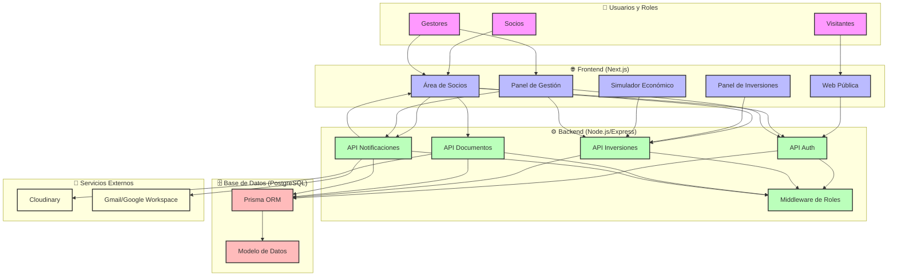

# 🏗️ Arquitectura del Sistema

## 🔹 1. Frontend (Cliente)

### Framework
- **Next.js** (React con renderizado híbrido: SSR + CSR)

### Ventajas
- Rápido de montar, documentado, y SEO-friendly para la parte pública
- Ideal para tener páginas protegidas (zona de socios) con autenticación
- Soporta subida de archivos, formularios, vídeo embebido, etc.

## 🔹 2. Backend (API)

### Framework
- **Node.js** con Express.js

### Organización
- API RESTful con servicios claramente definidos
- Autenticación: JWT + middleware por roles (visitante, socio, gestor, inversor)
- Uso de controladores y servicios para separar lógica

## 🔹 3. Base de Datos

### PostgreSQL
- Relacional, robusto, y bien soportado por ORMs como Prisma
- Ideal para manejar relaciones entre entidades (usuarios, inversiones, empresas, roles...)

## 🧱 Componentes del sistema implementados

| Componente | Tecnología Implementada | Comentario |
|------------|---------------------|------------|
| Web pública | Next.js | SSR para SEO (proyectos, contacto) |
| Área de socios | Next.js + JWT Auth | Acceso solo tras login + invitación |
| API privada | Node.js + Express.js | Servicios para login, inversiones, documentos, etc. |
| Base de datos | PostgreSQL + Prisma ORM | Implementada con migraciones y esquemas definidos |
| Autenticación | JWT con roles | Implementado con jsonwebtoken, middleware por roles |
| Almacenamiento de ficheros | Cloudinary | Para documentos, imágenes y videos con control de acceso |
| Hosting Frontend | Vercel | Configurado para despliegue continuo |
| Backend | Render | Configurado para la API con despliegue automático |
| Base de datos | Supabase | PostgreSQL gestionado con backups y monitorización |

## 🔐 Seguridad implementada

- HTTPS en todos los entornos
- JWT con expiración y renovación
- Control de acceso a documentos según nivel de permiso
- Validación de inputs con express-validator
- Rate limiting con express-rate-limit
- Helmet para cabeceras HTTP seguras
- Registro de acciones críticas para administradores

## 📦 Estructura de carpetas actual

```
/frontend        → Next.js app
  /pages          → Rutas y páginas
  /components     → Componentes reutilizables
  /context        → Contextos de React (auth, etc)
  /services       → Servicios para API
  /styles         → Estilos con Tailwind
  /utils          → Utilidades comunes
  /tests          → Tests de componentes y páginas

/backend         → Node.js API
  /domain        → Entidades y lógica de negocio core
    /entities    → Modelos de dominio
    /repositories → Interfaces de repositorios
    /services    → Servicios de dominio
  /application   → Casos de uso y servicios de aplicación
    /controllers → Controladores HTTP
    /routes      → Definición de rutas
    /services    → Servicios de aplicación
    /use_cases   → Casos de uso específicos
  /infrastructure → Implementaciones concretas
    /external    → Servicios externos (storage, email)
    /repositories → Implementaciones de repositorios
  /interfaces    → Interfaces para adaptadores externos
    /http        → Controladores y DTOs
    /storage     → Interfaces de almacenamiento
  /middleware    → Middleware Express (auth, validación)
  /prisma        → Esquemas y migraciones de Prisma
  /tests         → Tests unitarios e integración
  /utils         → Utilidades compartidas

/docs            → Documentación del proyecto
  /architecture  → Diagramas y diseño del sistema
  /api           → Documentación de la API
  /technical     → Guías técnicas y configuración
  /product       → Documentación del producto
  /frontend      → Guías específicas del frontend
  /images        → Recursos visuales para documentación

/prompts         → Prompts para desarrollo (IA)

/scripts         → Tareas automatizadas
```

## 🔄 Diagrama de Arquitectura



## ✅ Implementación actual

| Elemento | Estado actual | Notas |
|----------|--------------|-------|
| Next.js | ✅ Implementado | Versión 14.0.3 con React 18.2.0 |
| Express.js | ✅ Implementado | Versión 4.18.2 con middleware de seguridad |
| Prisma ORM | ✅ Implementado | Versión 5.5.2 con migraciones y esquemas |
| Autenticación JWT | ✅ Implementado | jsonwebtoken v9.0.2 con middleware por roles |
| Cloudinary | ✅ Implementado | Para almacenamiento de documentos, imágenes y videos |
| Estructura en capas | ✅ Implementado | Siguiendo arquitectura hexagonal y DDD |
| UI con Tailwind | ✅ Implementado | Con componentes personalizados y HeadlessUI |
| Testing | ✅ Parcialmente | Tests unitarios, integración y e2e con Jest y Cypress |

## 🧱 Elementos clave del sistema

| Elemento | Detalles de implementación |
|----------|----------------------------|
| Arquitectura | Hexagonal con capas domain, application, infrastructure e interfaces |
| Autenticación | Basada en JWT con tokens de acceso y middleware de verificación de roles |
| Almacenamiento | Sistema dual: local para desarrollo y Cloudinary para producción |
| Seguridad | Implementada mediante Helmet, validación de entradas y sanitización |
| UI/UX | Componentes React con Tailwind CSS y HeadlessUI para accesibilidad |
| Control de acceso | Granular por rol de usuario (visitante, socio, gestor, admin) |

## 📦 Estado de las funcionalidades principales

| Funcionalidad | Estado | Detalles |
|--------------|--------|----------|
| Registro por invitación | ✅ Completo | Sistema completo con envío de emails y validación |
| Publicación de proyectos | ✅ Completo | Sistema completo con gestión de documentos y media |
| Listado de proyectos | ✅ Completo | Con filtrado, ordenación y paginación |
| Visualización de proyectos | ✅ Completo | Con visualización de documentos e imágenes según permisos |
| Gestión de intereses | ✅ Completo | Sistema para marcar y gestionar intereses en proyectos |
| Gestión de inversiones | ✅ Completo | Sistema completo con diferentes estados y notificaciones |
| Verificación de email | ✅ Completo | Sistema con tokens de verificación y reenvío |