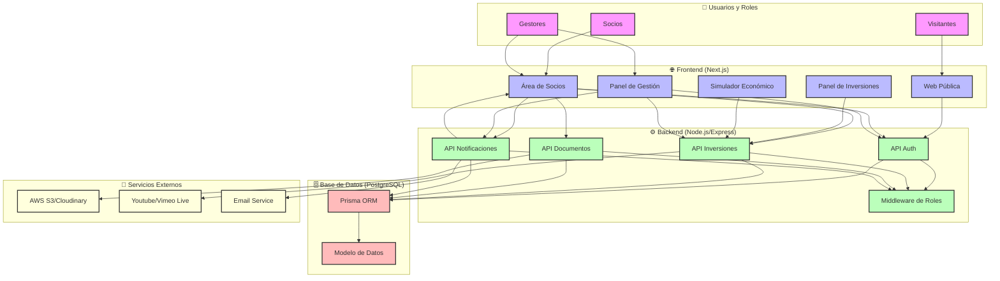

# 🏗️ Arquitectura del Sistema

## 🔹 1. Frontend (Cliente)

### Framework
- **Next.js** (React con renderizado híbrido: SSR + SSG)

### Ventajas
- Rápido de montar, documentado, y SEO-friendly para la parte pública
- Ideal para tener páginas protegidas (zona de socios) con autenticación
- Soporta subida de archivos, formularios, vídeo embebido, etc.

## 🔹 2. Backend (API)

### Framework
- **Node.js** con Express.js (o NestJS si el desarrollador tiene algo más de experiencia)

### Organización
- API RESTful con servicios claramente definidos
- Autenticación: JWT + middleware por roles (visitante, socio, gestor, inversor)
- Uso de controladores y servicios para separar lógica

## 🔹 3. Base de Datos

### PostgreSQL
- Relacional, robusto, y bien soportado por ORMs como Prisma
- Ideal para manejar relaciones entre entidades (usuarios, inversiones, empresas, roles...)

## 🧱 Componentes del sistema (mínimos para el MVP)

| Componente | Tecnología Sugerida | Comentario |
|------------|---------------------|------------|
| Web pública | Next.js | SSR para SEO (proyectos, blog, contacto) |
| Área de socios | Next.js + Auth por token | Acceso solo tras login + invitación |
| API privada | Node.js + Express.js | Servicios para login, inversiones, documentos, etc. |
| Base de datos | PostgreSQL + Prisma ORM | Fácil de trabajar y escalar |
| Autenticación | JWT con roles | Ligero, seguro, fácilmente ampliable |
| Almacenamiento de ficheros | AWS S3 o Cloudinary | Para vídeos, planos, informes. Solo vista, no descarga |
| Vídeo en directo | Youtube Live embebido o Vimeo Live | Muy fácil de integrar |
| Hosting Frontend | Vercel (Next.js optimizado) | Simplifica despliegue y escalado |
| Backend + DB | Railway o Render | Hosting fácil para proyectos pequeños sin DevOps |

## 🔐 Seguridad básica para el MVP

- HTTPS siempre (Let's Encrypt o Cloudflare)
- JWT con expiración y refresh
- Acceso a documentos controlado por permisos (sin descarga, solo vista)
- Validación de inputs en backend (para prevenir inyecciones)
- Registros de acciones críticas (audit trail básico para admins)

## 📦 Estructura de carpetas

```
/frontend        → Next.js app
  /pages
  /components
  /utils
  /services

/backend         → Node.js API
  /domain        → Entidades y lógica de negocio core
  /application   → Casos de uso
  /infrastructure → Implementaciones concretas
    /database    → Acceso a datos y Prisma
    /external    → Servicios externos (email, storage, etc.)
  /interfaces    → API, controladores, rutas
  /prisma        → Esquemas y migraciones de base de datos

/docs            → Documentación del proyecto
  /architecture  → Diagramas y diseño del sistema
  /technical     → Guías técnicas y configuración
  /product       → Documentación del producto

/scripts         → Tareas automatizadas (invitaciones, informes)

.env             → Configuración de variables sensibles
```

## 🔄 Diagrama de Arquitectura



## ✅ Simplificaciones para desarrollador junior

| Elemento | Sugerencia de simplificación | Justificación para el cambio |
|----------|-----------------------------|------------------------------|
| Next.js SSR + rutas protegidas | Usar Next.js en modo SPA (sin SSR para la zona de socios) | Menos configuración, más cercano a una SPA tradicional. Reduce problemas de sincronización |
| API modular por dominios | Unificar rutas en un solo archivo de rutas Express al principio | Facilita el desarrollo y el seguimiento del flujo de datos |
| Prisma ORM + relaciones complejas | Mantener Prisma, pero empezar con relaciones simples, sin onDelete, ni cascades complejas | Para evitar errores por falta de control en borrados o actualizaciones |
| Middleware de roles personalizado | Usar un middleware más genérico basado solo en nivel de rol (socio, gestor, etc.) | Reduce complejidad. Roles más finos se pueden añadir después |
| Servicios externos (S3, Vimeo, etc.) | Usar solo uno (por ejemplo, Cloudinary para vídeo e imagen, sin streaming en vivo de momento) | Menos configuración y claves de API para manejar |
| Sistema de notificaciones | Empezar con mensajes simples guardados en BBDD, mostrados en un panel, sin lógica push ni emails | Reduce dependencias externas y complejidad de infraestructura |
| Autenticación JWT | Mantener JWT pero usar librerías como jsonwebtoken + cookie/session-storage ya configuradas | Evita diseñar todo desde cero. Uso de plantillas o ejemplos sólidos |
| Control de acceso a documentos | En lugar de restricción por visualización embebida, usar enlace temporal firmado o privado en Cloudinary | Mucho más simple de configurar |

## 🧱 Elementos a mantener

| Elemento | Por qué mantenerlo |
|----------|-------------------|
| Next.js | Excelente base para crecer. Ya tiene herramientas de seguridad, auth, SSR, SSG |
| Node.js + Express | Muy documentado, fácil de depurar |
| Prisma + PostgreSQL | Hace más fácil trabajar con BBDD complejas. Documentación clara y buen tipado |
| Modelo en capas básico | Aunque sea más sencillo, mantiene el orden desde el inicio |

## 📦 Arquitectura simplificada para un desarrollador junior

```
📁 /frontend (Next.js)
  ├── /pages
  ├── /components
  └── /services (llamadas API)

📁 /backend (Node.js + Express)
  ├── /routes (agrupadas en un archivo único)
  ├── /controllers
  ├── /middleware (auth básico)
  └── /prisma (modelo de datos)

📁 /docs (Documentación)
  ├── /technical (guías de configuración)
  └── /images (recursos visuales)

🗃️ PostgreSQL (Railway o Supabase para hosting)

☁️ Cloudinary para imágenes, vídeos y documentos

🔐 Autenticación con JWT (usando librerías existentes)
```

## 🧑‍💻 Conclusión

Sí: la arquitectura puede mantenerse, pero simplificando implementaciones, flujo y dependencias externas, es mucho más amigable para un perfil junior.

💡 **Sugerencia:** construir el MVP como un proyecto en etapas, empezando con funcionalidades mínimas y expandiendo progresivamente con control de versiones y sprints guiados.