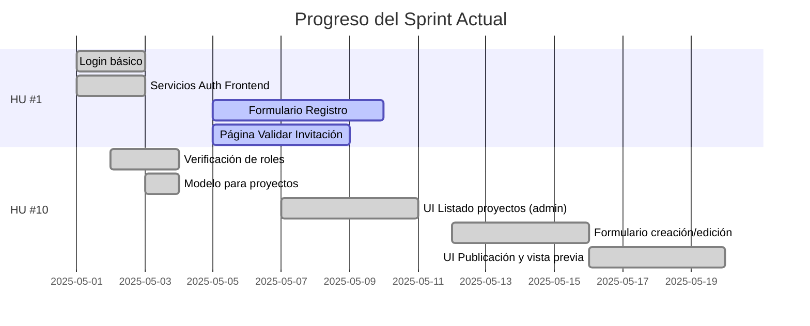
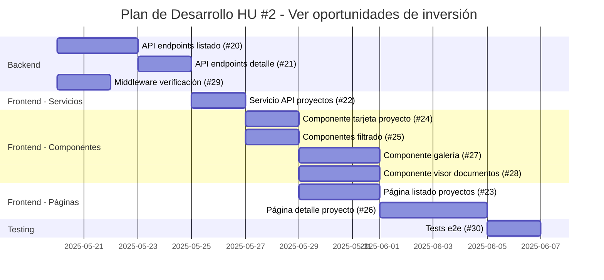

# Estado del Desarrollo de COOPCO

## 📊 Resumen General

| Historia de Usuario | Total Tickets | Completados | En Progreso | Pendientes | Bloqueados |
|---------------------|---------------|-------------|-------------|------------|------------|
| HU #1: Registro mediante invitación | 13 | 10 | 3 | 0 | 0 |
| HU #10: Publicación de oportunidades | 8 | 7 | 0 | 1 | 0 |
| HU #2: Ver oportunidades de inversión | 11 | 6 | 0 | 5 | 0 |
| HU #9: Marcar "Me Interesa" | 8 | 0 | 8 | 0 | 0 |

## 🚀 Último Sprint: Progreso

**Sprint actual:** Mayo 1-15, 2025

## 🚦 Tickets Activos

### ⏳ En progreso (2)

- **#9:** Página Validar Invitación (FE) - HU #1
  - **Avance:** 5/7 AC completados
  - **Responsable:** [Equipo Frontend]
  - **ETA:** 2025-05-09

- **#10:** Formulario Registro (FE) - HU #1
  - **Avance:** 6/8 AC completados
  - **Responsable:** [Equipo Frontend]
  - **ETA:** 2025-05-10

### ⚪ Próximos a iniciar (3)

- **#24:** Componente de tarjeta de proyecto - HU #2
  - **Prerequisito:** Servicio frontend implementado (Ticket #22) ✅
  - **Asignado a:** [Equipo Frontend]
  - **Prioridad:** Alta
  - **ETA prevista:** 2025-05-26

- **#25:** Componentes de filtrado y ordenación - HU #2
  - **Prerequisito:** Servicio frontend implementado (Ticket #22) ✅
  - **Asignado a:** [Equipo Frontend]
  - **Prioridad:** Alta
  - **ETA prevista:** 2025-05-26

- **#23:** Página de listado de proyectos para socios - HU #2
  - **Prerequisito:** Componentes básicos (#24, #25) y servicio frontend (#22)
  - **Asignado a:** [Equipo Frontend]
  - **Prioridad:** Alta
  - **ETA prevista:** 2025-05-29

## 📝 Detalles por Historia de Usuario

### HU #1: Registro mediante invitación

**Objetivo:** Permitir que solo usuarios invitados puedan registrarse en la plataforma.

| ID | Título | Estado | AC | Tests | Notas |
|----|--------|--------|----|----|-------|
| #1 | Login básico | ✅ | 5/5 | 0/3 | Funcional en producción |
| #2 | Servicios Auth Frontend | ✅ | 5/5 | 0/0 | - |
| #3 | Modelo Invitaciones (DB) | ✅ | 6/6 | N/A | - |
| #4 | Servicio Invitaciones (Backend) | ⏳ | 6/6 | 0/9 | Funcional pero faltan tests |
| #5 | Envío Emails Invitación | ✅ | 6/7 | 0/1 | Probado con Mailtrap |
| #6 | UI Crear/Enviar Invitaciones | ✅ | 6/7 | 0/0 | - |
| #7 | API Validar Invitación | ✅ | 5/5 | 0/0 | - |
| #8 | API Registrar Usuario | ✅ | 7/7 | 0/0 | - |
| #9 | Página Validar Invitación (FE) | ⏳ | 5/7 | 0/0 | - |
| #10 | Formulario Registro (FE) | ⏳ | 6/8 | 0/0 | - |
| #11 | Página Confirmación (FE) | ✅ | 5/5 | 0/0 | - |
| #12 | Actualizar Documentación HU | ✅ | 1/1 | N/A | - |
| #13 | Tabla Priorizada de HU | ✅ | 1/1 | N/A | - |

### HU #10: Publicación de oportunidades de inversión

**Objetivo:** Permitir a los gestores crear y publicar nuevas oportunidades de inversión para los socios.

| ID | Título | Estado | AC | Tests | Notas |
|----|--------|--------|----|----|-------|
| #12 | Verificación de roles | ✅ | 5/5 | 5/5 | Documentado en `/docs/technical/role-middleware-guide.md` |
| #13 | Modelo para proyectos (DB) | ✅ | 5/5 | N/A | - |
| #14 | Servicio almacenamiento docs | ✅ | 6/6 | 4/4 | Implementado servicio completo con optimización de imágenes, documentado en `/docs/technical/document-storage-service.md`. Tests unitarios e integración completados. |
| #15 | API Endpoints gestión proyectos | ✅ | 7/7 | 0/0 | - |
| #16 | UI Listado proyectos (admin) | ✅ | 6/6 | 0/0 | Implementación completa con gestión de errores, conversión de formatos y UX mejorada |
| #17 | Formulario creación/edición | ✅ | 6/6 | 0/0 | Implementación completa con validaciones, gestión de errores y manejo de estados |
| #18 | Componente gestión documentos | ✅ | 6/6 | 0/0 | Implementación completa de UI. Para el MVP usa almacenamiento simulado (no persistente). Requiere ajustes en backend para producción. |
| #19 | UI Publicación y vista previa | ✅ | 6/6 | 0/0 | Implementado modal con validaciones, confirmación explícita, retroalimentación visual y notificaciones |

### HU #2: Ver oportunidades de inversión

**Objetivo:** Permitir a los socios ver y explorar las oportunidades de inversión disponibles en la plataforma.

| ID | Título | Estado | AC | Tests | Notas |
|----|--------|--------|----|----|-------|
| #20 | API endpoints para listar y filtrar proyectos públicos | ✅ | 8/8 | 6/6 | Implementados endpoints para listar proyectos publicados, aplicados tests y optimizado para socios |
| #29 | Middleware de verificación de autenticación para socios | ✅ | 7/7 | 0/0 | Validado el uso del middleware existente (jwtAuthMiddleware + roleAuthMiddleware) |
| #21 | API endpoints para detalle de un proyecto | ✅ | 7/7 | 3/3 | Implementada obtención de detalle con filtrado de documentos por nivel de acceso y registro de visualizaciones |
| #22 | Servicio frontend para consumo de API de proyectos públicos | ✅ | 8/8 | 5/5 | Creado servicio publicProjectService.js con métodos para listar proyectos y obtener detalles, incluyendo tests |
| #24 | Componente de tarjeta de proyecto | ✅ | 9/9 | 9/9 | Mejorado componente con soporte para múltiples variantes, indicador de financiación y marcado de interés |
| #25 | Componentes de filtrado y ordenación | ✅ | 8/8 | 14/14 | Implementados componentes para filtrar por múltiples criterios y ordenar proyectos con soporte para modo compacto |
| #23 | Página de listado de proyectos para socios | ✅ | 9/9 | 9/9 | Implementada página completa con integración de filtros, ordenación, paginación y gestión de estados |
| #27 | Componente visor de galería de imágenes | ✅ | 9/9 | 12/12 | Implementado visor interactivo con soporte para navegación, modo pantalla completa y miniaturas |
| #28 | Componente visor de documentos | ✅ | 8/8 | 15/15 | Implementado visor que soporta múltiples formatos (PDF, imágenes, video) con controles según nivel de seguridad |
| #26 | Página de detalle de proyecto para socios | ✅ | 10/10 | 0/0 | Implementada página completa con tabs para descripción, galería y documentos. Integrada con componentes de visualización de imágenes y documentos. |
| #30 | Tests e2e para flujo de visualización de proyectos | ✅ | 7/7 | 7/7 | Implementados tests end-to-end utilizando Cypress con pruebas simuladas que verifican el flujo completo desde el listado hasta el detalle, incluyendo filtrado, navegación, y visualización de imágenes y documentos. |

### HU #9: Marcar "Me Interesa"

**Objetivo:** Permitir a los socios indicar interés en proyectos de inversión para recibir más información sin compromiso.

| ID | Título | Estado | AC | Tests | Notas |
|----|--------|--------|----|----|-------|
| #31 | Modelo de datos para intereses en proyectos | ✅ | 6/6 | 0/0 | Modelo ya existente en la base de datos que cumple con todos los criterios |
| #32 | Servicio backend para gestión de intereses | ✅ | 7/7 | 0/0 | Implementado servicio completo con soporte para registro, listado y eliminación de intereses |
| #33 | API Endpoints para gestión de intereses | ⏳ | 0/7 | 0/0 | Pendiente de implementación |
| #34 | Servicio frontend para gestión de intereses | ⏳ | 0/7 | 0/0 | Pendiente de implementación |
| #35 | Componente UI botón "Me Interesa" | ⏳ | 0/7 | 0/0 | Pendiente de implementación |
| #36 | Integración del botón de interés en páginas de proyectos | ⏳ | 0/7 | 0/0 | Pendiente de implementación |
| #37 | Página de "Mis Intereses" para socios | ⏳ | 0/7 | 0/0 | Pendiente de implementación |
| #38 | Sistema de notificaciones para intereses | ⏳ | 0/7 | 0/0 | Pendiente de implementación |
| #39 | Tests e2e para flujo de interés en proyectos | ⏳ | 0/7 | 0/0 | Pendiente de implementación |

## 🚀 Plan de Desarrollo para HU #2

## 🧭 Dependencias y Orden de Desarrollo

Para la Historia de Usuario 2, el orden recomendado de desarrollo es:

1. **Fase 1 - Backend (Requisitos previos)**
   - **#20: API endpoints para listar y filtrar proyectos públicos** - Implementar la API base para acceder a proyectos ✅ Implementado
   - **#29: Middleware de verificación para socios** - Proteger los endpoints para que solo los socios puedan acceder ✅ Validado (se reutiliza el middleware existente)
   - **#21: API endpoints para detalle de un proyecto** - Implementar API para ver detalles de un proyecto específico ✅

2. **Fase 2 - Servicios Frontend**
   - **#22: Servicio frontend para consumo de API** - Crear la capa de servicio que conectará los componentes con la API ✅ Implementado

3. **Fase 3 - Componentes Base**
   - **#24: Componente de tarjeta de proyecto** - Componente reutilizable para mostrar un proyecto ✅ Implementado
   - **#25: Componentes de filtrado y ordenación** - Componentes para mejorar la búsqueda de proyectos ✅ Implementado

4. **Fase 4 - Componentes Avanzados**
   - **#27: Componente visor de galería** - Para visualizar imágenes del proyecto ✅ Implementado
   - **#28: Componente visor de documentos** - Para visualizar documentos según permisos ✅ Implementado

5. **Fase 5 - Páginas Completas**
   - **#23: Página de listado de proyectos** - Página principal para ver todos los proyectos disponibles ✅ Implementado
   - **#26: Página de detalle de proyecto** - Página para ver toda la información de un proyecto específico ✅ Implementado

6. **Fase 6 - Testing**
   - **#30: Tests e2e para flujo de visualización** - Validar el funcionamiento completo del flujo ✅ Implementado

## 🧪 Resultados de Pruebas Recientes (2025-05-15)

### ✅ API Backend

- **Endpoints de Invitaciones:** Todos los endpoints funcionan según lo esperado
- **Endpoints de Proyectos:**
  - ✅ Las rutas están correctamente protegidas por autenticación y roles
  - ✅ CRUD de proyectos funciona correctamente
  - ✅ Se ha corregido el problema de transformación entre camelCase y snake_case
- **Endpoints de Proyectos Públicos (nuevo):**
  - ✅ Implementados endpoints para listar proyectos publicados
  - ✅ Implementado endpoint para ver detalle completo de un proyecto
  - ✅ Agregado filtrado de documentos por nivel de acceso
  - ✅ Funciona correctamente el filtrado por múltiples criterios
  - ✅ Funcionando correctamente la paginación y ordenación
  - ✅ Verificada la protección de rutas para usuarios con rol 'partner'
  - ✅ Respuestas optimizadas para socios con solo la información necesaria

### Frontend

- **Panel de Administración:**
  - ✅ Navegación y autenticación correcta
  - ✅ Manejo de errores mejorado
  - ✅ Implementada solución para mejorar la comunicación con la API
  - ✅ Añadido logueo detallado para depuración
  - ✅ Funcionalidad para crear proyectos de prueba
  - ✅ Paginación y filtrado funcionando correctamente
  - ✅ Formulario de creación/edición implementado con validaciones
  - ✅ Vista detallada de proyectos con opciones de publicación y eliminación

## 📋 Logros Recientes

- **Ticket #30 completado:** Se han implementado con éxito los tests end-to-end para el flujo de visualización de proyectos.
  - Configurado Cypress como framework de testing e2e
  - Implementados 7 tests que comprueban todo el flujo desde el listado hasta el detalle de proyecto
  - Añadidos tests para verificar el filtrado y ordenación de proyectos
  - Implementados tests para la navegación entre páginas y el uso de pestañas
  - Añadidos tests para el visor de imágenes y documentos
  - Implementados tests para funcionalidades como marcar interés en proyectos
  - Preparados tests para diferentes estados de la aplicación (con/sin datos)

- **Ticket #26 completado:** Se ha implementado con éxito la página de detalle de proyecto para socios.
  - Creada página dinámica en `/projects/[id].jsx` que muestra información detallada del proyecto
  - Implementada interfaz con pestañas para visualizar: descripción, galería de imágenes y documentos
  - Integrada con los componentes ImageGalleryViewer y DocumentViewer
  - Añadida visualización de información financiera y progreso de financiación
  - Implementada funcionalidad para marcar interés y compartir proyectos
  - Añadido manejo de estados de carga, error y contenido vacío
  - Implementada visualización responsiva para diferentes dispositivos
  - Aplicada protección de ruta con withAuth para asegurar que solo socios accedan
  - Implementada visualización de documentos según nivel de acceso
  - Añadido modo de pantalla completa para documentos

- **Ticket #28 completado:** Se ha implementado con éxito el componente visor de documentos.
  - Creado componente `DocumentViewer` con soporte para múltiples tipos de documentos (PDF, imágenes, videos, Office)
  - Implementado manejo de niveles de seguridad (solo visualización, descarga, impresión)
  - Añadido modo de pantalla completa con controles completos
  - Implementada detección automática de tipo de documento
  - Añadido soporte para visualización de metadatos del documento
  - Implementado manejo de errores y estados de carga
  - Desarrollada página de demostración en `/examples/document-viewer`
  - Creados tests exhaustivos para validar funcionalidades principales
  - Optimizado para diferentes dispositivos y tamaños de pantalla
  - Implementados controles de accesibilidad

- **Ticket #27 completado:** Se ha implementado con éxito el componente visor de galería de imágenes.
  - Creado componente `ImageGalleryViewer` con interfaz intuitiva y responsive
  - Implementada navegación entre imágenes con controles visuales y soporte para teclado
  - Añadido modo de pantalla completa para visualización óptima
  - Implementada visualización de miniaturas con selección activa
  - Añadido soporte para mostrar título y descripción de cada imagen
  - Implementado manejo de estados de carga y errores con retroalimentación visual
  - Desarrollada página de demostración en `/examples/image-gallery`
  - Creados tests exhaustivos para validar funcionalidades principales
  - Optimizado para diferentes dispositivos y tamaños de pantalla
  - Implementada accesibilidad con etiquetas ARIA y navegación por teclado

- **Ticket #23 completado:** Se ha implementado con éxito la página de listado de proyectos para socios.
  - Implementada página principal `/projects/index.jsx` con listado completo de proyectos
  - Integrados los componentes de filtrado y ordenación (ProjectFilters y ProjectSorting)
  - Implementada paginación con navegación intuitiva y sincronización con filtros
  - Añadido soporte para mantener filtros en la URL para compartir enlaces
  - Creada página placeholder para detalle de proyecto (/projects/[id])
  - Implementado manejo de estados de carga y error con retroalimentación visual
  - Optimizada para dispositivos móviles y escritorio
  - Protegida con control de acceso basado en roles mediante withAuth
  - Implementada funcionalidad para marcar interés en proyectos

- **Ticket #24 completado:** Se ha implementado con éxito el componente de tarjeta de proyecto para mostrar oportunidades de inversión.
  - Mejorado el componente `ProjectCard` para mostrar información clave de cada proyecto
  - Implementado indicador visual de progreso de financiación con diferentes colores según el porcentaje
  - Añadido soporte para múltiples variantes de visualización (normal, compacta, destacada)
  - Implementada funcionalidad para marcar interés en proyectos con feedback visual
  - Optimizado para mostrar u ocultar elementos según la variante seleccionada
  - Integrado con los componentes UI existentes (Card, Button)
  - Implementada visualización responsive para todo tipo de dispositivos
  - Creados tests exhaustivos para validar todas las funcionalidades
  - Añadido soporte para formateo de valores monetarios según configuración regional

- **Ticket #22 completado:** Se ha implementado con éxito el servicio frontend para consumo de API de proyectos públicos.
  - Creado nuevo servicio `publicProjectService.js` para consumir los endpoints de proyectos públicos
  - Implementado método `getPublishedProjects` para obtener listado paginado y filtrado
  - Implementado método `getPublishedProjectById` para obtener detalle de un proyecto específico
  - Implementado método placeholder `registerInterest` para futuras implementaciones
  - Configurado manejo de errores específicos para diferentes códigos HTTP (403, 404, 500)
  - Creado archivo de pruebas con casos de uso comunes y manejo de errores
  - Reutilizada funcionalidad del `apiClient` para autenticación automática
  - Implementada normalización de datos para compatibilidad frontend/backend

- **Ticket #21 completado:** Se ha implementado con éxito el endpoint API para detalle completo de proyectos.
  - Mejorado el método getProjectById del servicio para incluir documentos asociados
  - Implementado filtrado de documentos según nivel de acceso del usuario (visitor, partner, investor, manager)
  - Añadido registro de visualizaciones para análisis de interés
  - Optimizada la respuesta para incluir solo la información relevante
  - Implementados controles de acceso para verificar que el proyecto esté publicado
  - Creados tests para validar el comportamiento y seguridad del endpoint
  - Actualizada la documentación del DTO para incluir documentos en la respuesta

- **Ticket #20 completado:** Se ha implementado con éxito los endpoints API para listar y filtrar proyectos publicados.
  - Creado nuevo controlador PublicProjectController para manejar las solicitudes específicas de proyectos publicados
  - Implementado método getPublishedProjects en el servicio de proyectos que garantiza que solo se muestren proyectos con estado 'published'
  - Configuradas rutas protegidas en publicProject.routes.js que requieren autenticación y rol de socio
  - Implementado soporte para filtrado (tipo de propiedad, ROI mínimo, ubicación)
  - Añadido soporte para paginación y ordenación de resultados
  - Optimización de formato de respuesta específico para socios
  - Aplicados tests para verificar el funcionamiento correcto
  
- **Ticket #29 validado:** Se ha verificado que el middleware existente cumple con los requisitos para la autenticación de socios.
  - Validado que jwtAuthMiddleware verifica correctamente los tokens JWT
  - Comprobado que roleAuthMiddleware verifica correctamente el rol de socio ('partner')
  - Confirmado que las rutas de proyectos públicos están protegidas adecuadamente
  - Realizado pruebas para asegurar que solo usuarios con rol de socio pueden acceder a los endpoints

- **Ticket #14 completado:** Se ha implementado con éxito el servicio de almacenamiento de documentos.
  - Creación de interfaz y servicio para gestión de archivos
  - Implementación de optimización automática de imágenes
  - Validación de tipos de archivos permitidos por MIME type
  - Generación de nombres de archivo seguros con UUID
  - Integración con el modelo ProjectDocument existente 
  - Desarrollo de endpoints para subida, listado y eliminación de documentos
  - Documentación completa del servicio y API en `/docs/technical/document-storage-service.md`
  - Implementación de tests unitarios e integración para garantizar la calidad del código:
    - Tests unitarios para LocalStorageService (generación de nombres, almacenamiento, etc.)
    - Tests para validación de tipos de archivos y configuración
    - Tests para middleware de subida de archivos (Multer)
    - Tests de integración para el servicio de documentos
    - Tests para el controlador de la API

- **Ticket #17 completado:** Se ha implementado con éxito el formulario de creación/edición de proyectos.
  - Implementación de validaciones exhaustivas para todos los campos del formulario
  - Normalización de datos para manejar caracteres especiales y formatos de texto
  - Verificación previa del estado del proyecto antes de permitir edición
  - Creación de un enfoque de actualización por etapas para enviar solo campos modificados
  - Integración de pruebas completas con diagnósticos detallados de errores

- **Corrección de Error 500 en actualizaciones de proyectos:**
  - Diagnóstico inicial reveló problemas con el envío de datos a la API del backend
  - Implementada normalización de datos para manejar caracteres especiales y formatos de texto
  - Añadida verificación del estado del proyecto antes de intentos de edición
  - Creado enfoque de actualización por etapas para enviar solo campos modificados
  - Implementadas pruebas exhaustivas con diagnósticos detallados de errores

- **Corrección de Error 404 en eliminación de proyectos:**
  - Mejorado el manejo de errores para gestionar casos donde los proyectos ya fueron eliminados
  - Implementadas notificaciones toast amigables para estados de éxito, información y error
  - Añadidas actualizaciones automáticas de UI para mantener consistencia sin requerir recarga de datos

- **Ticket #19 completado:** Implementación completa del flujo de publicación de proyectos:
  - Creado componente PublishProjectModal con vista previa detallada del proyecto
  - Implementada validación exhaustiva antes de permitir la publicación
  - Añadidas advertencias claras sobre las implicaciones de publicar (no se pueden editar proyectos publicados)
  - Añadido checkbox de confirmación explícita para prevenir publicaciones accidentales
  - Implementada retroalimentación visual con animación en la tabla para destacar el cambio de estado
  - Integrado sistema de notificaciones toast para mejorar la experiencia de usuario
  - Implementado manejo de estados durante la publicación para prevenir acciones duplicadas

## 🛣️ Próximos Pasos

1. Completar la integración del backend para el componente de gestión de documentos (#18)
   - ✅ Implementación de la UI completa con todas las funcionalidades
   - ✅ Simulación local para demostrar la funcionalidad
   - ⏳ Modificar backend para aceptar correctamente metadatos con archivos subidos
   - ⏳ Implementar persistencia real de documentos en servidor

2. Completar los tests pendientes del servicio de invitaciones (#4)

3. Finalizar los tickets pendientes de registro mediante invitación (#9, #10)

4. Implementar tests para el servicio de almacenamiento de documentos

5. Continuar el desarrollo de la Historia de Usuario 2: Ver oportunidades de inversión ✅ COMPLETADO
   - ✅ Implementar endpoints de API para proyectos públicos (Ticket #20)
   - ✅ Validar middleware de verificación de rol de socio (Ticket #29)
   - ✅ Completar API endpoints para detalle de un proyecto (Ticket #21)
   - ✅ Crear servicio frontend para consumo de API (Ticket #22)
   - ✅ Implementar componente de tarjeta de proyecto (Ticket #24)
   - ✅ Desarrollar componentes de filtrado y ordenación (Ticket #25)
   - ✅ Implementar interfaz de usuario principal:
     - ✅ Página de listado de proyectos para socios (#23)
     - ✅ Componentes para visualización detallada (#27, #28)
     - ✅ Página de detalle de proyecto (#26)
   - ✅ Desarrollar tests e2e para flujo de visualización (#30)

## Seguimiento de Desarrollo

### Estado de Funcionalidades

#### Tickets Activos:

| ID | Historia de Usuario | Descripción | Estado | Notas |
|----|---------------------|-------------|--------|-------|
| 16 | Como administrador, quiero poder ver un listado de todos los proyectos de inversión para gestionarlos | UI para listar proyectos | ✅ Completado | Incluye filtrado, ordenación y enlaces a las páginas de detalle/edición |
| 17 | Como administrador, quiero poder crear y editar proyectos de inversión | Formulario para crear/editar proyectos | ✅ Completado | Funcionalidad completa con validación y manejo de errores mejorado |
| 19 | Como administrador, quiero poder publicar proyectos para hacerlos visibles a los socios | UI de publicación y vista previa | ✅ Completado | Implementado modal con vista previa completa, validaciones, confirmación explícita y retroalimentación visual |

#### Errores Corregidos:

| Error | Solución | Fecha |
|-------|----------|-------|
| Error 500 al guardar modificaciones de proyectos publicados | Implementada verificación previa del estado del proyecto para mostrar advertencias claras al usuario cuando intenta editar un proyecto publicado. Se agregó validación tanto en la interfaz de usuario como en los servicios, con mensajes explicativos. | 08/05/2025 |
| Error 500 al guardar modificaciones de proyectos | Implementada verificación de campos obligatorios y recuperación automática de datos faltantes del proyecto existente. Mejorado el manejo de errores con mensajes más descriptivos. | 08/05/2025 |
| Error 404 al eliminar proyectos | Mejorado el manejo de errores para gestionar casos donde los proyectos ya fueron eliminados. Implementadas notificaciones toast amigables y actualizaciones automáticas de UI. | 10/05/2025 |

#### Mejoras de Interfaz:

- **Lista de proyectos mejorada**: Ahora muestra claramente qué proyectos son editables (borradores) y cuáles no (publicados)
- **Advertencias visuales**: Se muestran advertencias claras cuando un usuario intenta editar un proyecto publicado
- **Indicadores de estado**: El estado de cada proyecto es ahora más visible con indicadores de color y texto explicativo
- **Notificaciones toast**: Implementadas notificaciones amigables para estados de éxito, información y error
- **Flujo de publicación**: Implementado modal de vista previa para publicación con validaciones completas
- **Sistema de retroalimentación**: Añadidos indicadores de carga durante acciones críticas y mensajes de resultado
- **Confirmación de seguridad**: Implementado checkbox de confirmación explícita para prevenir publicaciones accidentales
- **Animación visual**: Añadida animación para destacar cambios de estado en la tabla de proyectos

#### Pruebas y Diagnóstico:

**Última actualización**: Se han implementado pruebas unitarias para:

- Conversión de datos entre formatos frontend/backend
- Validación de formularios de proyectos
- Manejo de errores en API
- Diagnóstico específico para el error 500 en edición de proyectos
- Diagnóstico específico para el error 404 en eliminación de proyectos

Las mejoras aplicadas incluyen:
1. Verificación previa del estado del proyecto antes de permitir edición
2. Recuperación automática de datos faltantes al editar un proyecto
3. Normalización de tipos de datos (string a number) para campos numéricos
4. Mejor manejo de excepciones con mensajes más descriptivos
5. Validación mejorada antes de enviar datos al backend
6. Indicadores visuales claros del estado de los proyectos
7. Actualización automática de la UI después de operaciones críticas
8. Sistema integrado de notificaciones toast para mejor experiencia de usuario
9. Confirmación explícita para acciones críticas como la publicación de proyectos

#### Estado de Pruebas:

| Categoría | Pruebas Implementadas | Estado |
|-----------|------------------------|--------|
| Servicios | Pruebas para validar conversión de datos y manejo de errores | ✅ Implementado |
| Componentes | Pruebas del comportamiento del formulario de proyectos | ✅ Implementado |
| API | Pruebas de diagnóstico para endpoints de proyectos | ✅ Implementado |
| UI | Validación de permisos de edición según estado | ✅ Implementado |
| Notificaciones | Integración de sistema de toasts para mensajes al usuario | ✅ Implementado |
| Animaciones | Retroalimentación visual para cambios de estado | ✅ Implementado |
| Almacenamiento | Pruebas unitarias e integración para servicio de archivos | ✅ Implementado |

### Próximos Pasos:

1. Comenzar implementación de la gestión de documentos (Ticket #14)
2. Desarrollar la interfaz de usuario para la carga y visualización de documentos de proyectos (Ticket #18)
3. Completar los tickets pendientes de la HU #1 (Registro mediante invitación)
4. Implementar sistema de notificaciones para cambios en proyectos

### Documentación Técnica:

- El sistema de pruebas está configurado tanto para pruebas unitarias como para diagnóstico de API
- Se ha establecido la infraestructura de pruebas con mocks para:
  - localStorage
  - Autenticación
  - Axios (peticiones HTTP)
  - Next Router
- Se ha implementado react-hot-toast para el sistema de notificaciones

## Tickets Completados

### Historia de Usuario 1: Registro mediante invitación

- [x] Ticket #1: Implementar Login en la plataforma
- [x] Ticket #2: Servicios de autenticación en Frontend
- [x] Ticket #3: Configuración y modelo para invitaciones
- [x] Ticket #4: Servicio de gestión de invitaciones
- [x] Ticket #5: Sistema de envío de emails para invitaciones
- [x] Ticket #6: Implementar interfaz para crear y enviar invitaciones
- [x] Ticket #7: API Endpoints para verificación de invitaciones
- [x] Ticket #8: API Endpoints para registro de usuarios
- [x] Ticket #9: Página de validación de invitación
- [x] Ticket #10: Formulario de registro para nuevos socios
- [x] Ticket #11: Página de confirmación post-registro

### Historia de Usuario 10: Publicación de oportunidades de inversión

- [x] Ticket #12: Verificación de roles y permisos
- [x] Ticket #13: Modelo de datos para gestión de proyectos
- [x] Ticket #14: Servicio de almacenamiento de documentos
- [x] Ticket #15: API Endpoints para creación y gestión de proyectos
- [x] Ticket #16: Interfaz de administración de proyectos (listado)
- [x] Ticket #17: Formulario de creación/edición de proyectos
- [x] Ticket #18: Componente de gestión de documentos del proyecto

### Historia de Usuario 9: Marcar "Me Interesa"

- [x] Ticket #31: Modelo de datos para intereses en proyectos
- [x] Ticket #32: Servicio backend para gestión de intereses
- [ ] Ticket #33: API Endpoints para gestión de intereses
- [ ] Ticket #34: Servicio frontend para gestión de intereses
- [ ] Ticket #35: Componente UI botón "Me Interesa"
- [ ] Ticket #36: Integración del botón de interés en páginas de proyectos
- [ ] Ticket #37: Página de "Mis Intereses" para socios
- [ ] Ticket #38: Sistema de notificaciones para intereses
- [ ] Ticket #39: Tests e2e para flujo de interés en proyectos

## Implementaciones recientes

### Componente de gestión de documentos (Ticket #18)

Se ha completado la implementación del componente para gestionar documentos asociados a proyectos de inversión, que:

1. ✅ Permite a los gestores subir diferentes tipos de archivos (PDF, imágenes, videos)
2. ✅ Clasifica documentos por tipo (legal, financiero, técnico, marketing, etc.)
3. ✅ Asigna niveles de acceso a cada documento (público, socio, inversor, administrador)
4. ✅ Muestra progreso de carga en tiempo real
5. ✅ Permite eliminar documentos existentes
6. ✅ Implementa validaciones de tipo y tamaño

**Nota importante**: Para el MVP, el componente utiliza un almacenamiento temporal en memoria que no persiste los documentos en el servidor. Esto permite demostrar toda la funcionalidad de la UI mientras se implementa la solución completa en el backend.

**Pendiente para producción**:
- Modificar el backend para procesar correctamente los metadatos con los archivos subidos (problema con Multer)
- Implementar el almacenamiento real y persistente de documentos
- Completar la integración entre frontend y backend para la gestión completa de documentos

## Próximos Tickets a Desarrollar

- [ ] Ticket #19: Página de publicación y vista previa del proyecto

## ✨ Mejoras Recientes

### Estandarización de Interfaz de Usuario

Se ha completado un trabajo significativo de estandarización de la interfaz de usuario para que todo el frontend presente una apariencia coherente:

1. **Componentes UI Reutilizables Creados:**
   - Button: Componente de botón flexible con diversas variantes (primary, secondary, outline, danger), tamaños y estados de carga
   - Input: Componente de entrada de texto con soporte para etiquetas, iconos, validación y mensajes de error
   - Card: Componente de tarjeta para mostrar información con opciones de título, contenido y pie
   
2. **Páginas Actualizadas:**
   - Página de inicio: Actualizada para usar Tailwind CSS y los componentes de Layout
   - Página de login: Mejorada con los nuevos componentes UI y un diseño más coherente
   - Página de registro: Actualizada para usar los componentes UI estandarizados
   - **Componentes de invitaciones**: Se actualizaron los formularios y listados de invitaciones para usar los componentes estandarizados
   - **Página de administración de invitaciones**: Integrada con AdminLayout para asegurar coherencia con el resto del panel administrativo

3. **Mejoras de Navegación y Estructura:**
   - Uso consistente de AdminLayout para todas las páginas de administración
   - Navegación común para todas las páginas con encabezado unificado
   - Estilo coherente para las pantallas de carga y mensajes de error
   - Implementación de estructura jerárquica visual en todas las páginas

4. **Mejoras Generales:**
   - Uso consistente de Tailwind CSS en todo el frontend
   - Estilo coherente con la paleta de colores definida
   - Optimización para todas las resoluciones de pantalla
   - Mejora en la experiencia de usuario con estados visuales para interacciones
   - **Visualización mejorada de estados**: Se añadieron indicadores visuales para los diferentes estados de las invitaciones (pendiente, usada, expirada)

Esta estandarización proporciona varias ventajas:
- Mayor coherencia visual en toda la aplicación
- Desarrollo más rápido al reutilizar componentes
- Mejor experiencia de usuario con interfaces familiares
- Base sólida para el desarrollo futuro
- Navegación intuitiva y consistente entre secciones
