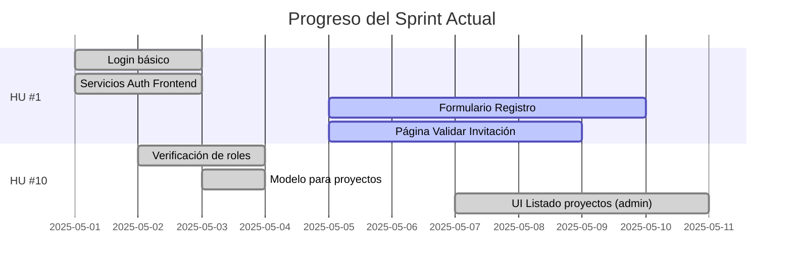

# Estado del Desarrollo de COOPCO

## 📊 Resumen General

| Historia de Usuario | Total Tickets | Completados | En Progreso | Pendientes | Bloqueados |
|---------------------|---------------|-------------|-------------|------------|------------|
| HU #1: Registro mediante invitación | 13 | 10 | 3 | 0 | 0 |
| HU #10: Publicación de oportunidades | 8 | 4 | 0 | 4 | 0 |

## 🚀 Último Sprint: Progreso

**Sprint actual:** Mayo 1-15, 2025

## 🚦 Tickets Activos

### ⏳ En progreso (3)

- **#9:** Página Validar Invitación (FE) - HU #1
  - **Avance:** 5/7 AC completados
  - **Responsable:** [Equipo Frontend]
  - **ETA:** 2025-05-09

- **#10:** Formulario Registro (FE) - HU #1
  - **Avance:** 6/8 AC completados
  - **Responsable:** [Equipo Frontend]
  - **ETA:** 2025-05-10

- **#4:** Servicio de gestión de invitaciones - HU #1
  - **Avance:** 6/6 AC completados, 0/9 Tests
  - **Responsable:** [Equipo Backend]
  - **ETA:** 2025-05-12 (solo para tests)

### ⚪ Próximos a iniciar (2-3)

- **#17:** Formulario creación/edición de proyectos - HU #10
  - **Dependencias:** #15 ✅ 
  - **Prioridad:** Alta

- **#14:** Servicio almacenamiento documentos - HU #10
  - **Prioridad:** Media
  - **Notas:** Definir estrategia de almacenamiento

## 📝 Detalles por Historia de Usuario

### HU #1: Registro mediante invitación

**Objetivo:** Permitir que solo usuarios invitados puedan registrarse en la plataforma.

| ID | Título | Estado | AC | Tests | Notas |
|----|--------|--------|----|----|-------|
| #1 | Login básico | ✅ | 5/5 | 0/3 | Funcional en producción |
| #2 | Servicios Auth Frontend | ✅ | 5/5 | 0/0 | - |
| #3 | Modelo Invitaciones (DB) | ✅ | 6/6 | N/A | - |
| #4 | Servicio Invitaciones (Backend) | ⏳ | 6/6 | 0/9 | Funcional pero faltan tests |
| #5 | Envío Emails Invitación | ✅ | 6/7 | 0/1 | Probado con Mailtrap |
| #6 | UI Crear/Enviar Invitaciones | ✅ | 6/7 | 0/0 | - |
| #7 | API Validar Invitación | ✅ | 5/5 | 0/0 | - |
| #8 | API Registrar Usuario | ✅ | 7/7 | 0/0 | - |
| #9 | Página Validar Invitación (FE) | ⏳ | 5/7 | 0/0 | - |
| #10 | Formulario Registro (FE) | ⏳ | 6/8 | 0/0 | - |
| #11 | Página Confirmación (FE) | ✅ | 5/5 | 0/0 | - |
| #12 | Actualizar Documentación HU | ✅ | 1/1 | N/A | - |
| #13 | Tabla Priorizada de HU | ✅ | 1/1 | N/A | - |

### HU #10: Publicación de oportunidades de inversión

**Objetivo:** Permitir a los gestores crear y publicar nuevas oportunidades de inversión para los socios.

| ID | Título | Estado | AC | Tests | Notas |
|----|--------|--------|----|----|-------|
| #12 | Verificación de roles | ✅ | 5/5 | 5/5 | Documentado en `/docs/technical/role-middleware-guide.md` |
| #13 | Modelo para proyectos (DB) | ✅ | 5/5 | N/A | - |
| #14 | Servicio almacenamiento docs | ⚪ | 0/6 | 0/0 | - |
| #15 | API Endpoints gestión proyectos | ✅ | 7/7 | 0/0 | - |
| #16 | UI Listado proyectos (admin) | ✅ | 6/6 | 0/0 | Implementación completa con gestión de errores, conversión de formatos y UX mejorada |
| #17 | Formulario creación/edición | ⚪ | 0/6 | 0/0 | - |
| #18 | Componente gestión documentos | ⚪ | 0/6 | 0/0 | Depende de #14 |
| #19 | UI Publicación y vista previa | ⚪ | 0/6 | 0/0 | Depende de #17 |

## 🧪 Resultados de Pruebas Recientes (2025-05-11)

### ✅ API Backend

- **Endpoints de Invitaciones:** Todos los endpoints funcionan según lo esperado
- **Endpoints de Proyectos:**
  - ✅ Las rutas están correctamente protegidas por autenticación y roles
  - ✅ CRUD de proyectos funciona correctamente
  - ✅ Se ha corregido el problema de transformación entre camelCase y snake_case

### Frontend

- **Panel de Administración:**
  - ✅ Navegación y autenticación correcta
  - ✅ Manejo de errores mejorado
  - ✅ Implementada solución para mejorar la comunicación con la API
  - ✅ Añadido logueo detallado para depuración
  - ✅ Funcionalidad para crear proyectos de prueba
  - ✅ Paginación y filtrado funcionando correctamente

## 📋 Logros Recientes

- **Ticket #16 completado:** Se ha implementado con éxito la interfaz de listado de proyectos para administradores.
  - Se solucionó el problema crítico en `authService.js` al implementar la función `getAuthToken()`
  - Se mejoró el manejo de errores y la retroalimentación al usuario
  - Se optimizó la actualización de la lista de proyectos sin necesidad de recargar todos los datos

- **Mejoras de UI/UX:** Se han implementado mejoras significativas en la interfaz de usuario:
  - Eliminación de elementos duplicados en la página de administración de proyectos
  - Integración de acceso a administración en la barra de navegación para usuarios con roles adecuados
  - Reorganización de controles para una experiencia más intuitiva
  - Mostrado condicional de botones según el contexto (ej: botón de actualizar sólo aparece cuando hay proyectos)

## 🛣️ Próximos Pasos

1. Empezar a trabajar en el formulario de creación/edición (#17)
   - Reutilizar los avances y aprendizajes del ticket #16
   - Implementar validación de campos

2. Definir estrategia para almacenamiento de documentos (#14)
   - Evaluar opciones: S3, almacenamiento local, etc.

3. Completar los tests pendientes del servicio de invitaciones (#4)