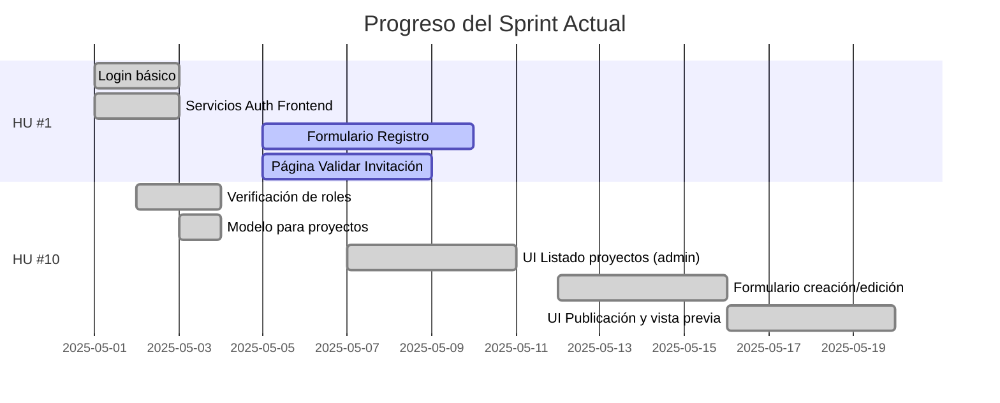
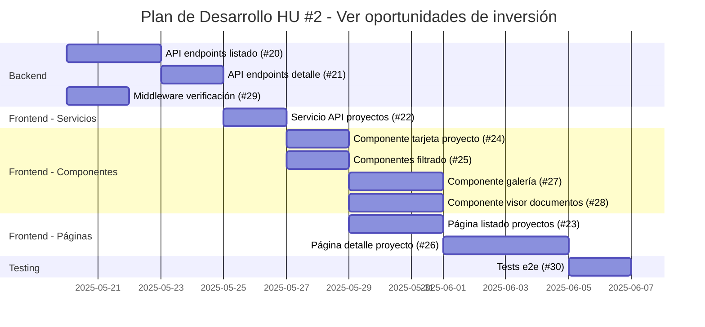

# Estado del Desarrollo de COOPCO

## 📊 Resumen General

| Historia de Usuario | Total Tickets | Completados | En Progreso | Pendientes | Bloqueados |
|---------------------|---------------|-------------|-------------|------------|------------|
| HU #1: Registro mediante invitación | 13 | 10 | 3 | 0 | 0 |
| HU #10: Publicación de oportunidades | 8 | 7 | 0 | 1 | 0 |
| HU #2: Ver oportunidades de inversión | 11 | 6 | 0 | 5 | 0 |
| HU #9: Marcar "Me Interesa" | 8 | 8 | 0 | 0 | 0 |
| HU #3: Marcar "Invierto" | 12 | 7 | 0 | 5 | 0 |
| HU #7: Confirmación de correo electrónico | 6 | 6 | 0 | 0 | 0 |

## 🚀 Último Sprint: Progreso

**Sprint actual:** Mayo 1-15, 2025

## 🚦 Tickets Activos

### ⏳ En progreso (2)

- **#9:** Página Validar Invitación (FE) - HU #1
  - **Avance:** 5/7 AC completados
  - **Responsable:** [Equipo Frontend]
  - **ETA:** 2025-05-09

- **#10:** Formulario Registro (FE) - HU #1
  - **Avance:** 6/8 AC completados
  - **Responsable:** [Equipo Frontend]
  - **ETA:** 2025-05-10

### ⚪ Próximos a iniciar (3)

- **#24:** Componente de tarjeta de proyecto - HU #2
  - **Prerequisito:** Servicio frontend implementado (Ticket #22) ✅
  - **Asignado a:** [Equipo Frontend]
  - **Prioridad:** Alta
  - **ETA prevista:** 2025-05-26

- **#25:** Componentes de filtrado y ordenación - HU #2
  - **Prerequisito:** Servicio frontend implementado (Ticket #22) ✅
  - **Asignado a:** [Equipo Frontend]
  - **Prioridad:** Alta
  - **ETA prevista:** 2025-05-26

- **#23:** Página de listado de proyectos para socios - HU #2
  - **Prerequisito:** Componentes básicos (#24, #25) y servicio frontend (#22)
  - **Asignado a:** [Equipo Frontend]
  - **Prioridad:** Alta
  - **ETA prevista:** 2025-05-29

## 📝 Detalles por Historia de Usuario

### HU #1: Registro mediante invitación

**Objetivo:** Permitir que solo usuarios invitados puedan registrarse en la plataforma.

| ID | Título | Estado | AC | Tests | Notas |
|----|--------|--------|----|----|-------|
| #1 | Login básico | ✅ | 5/5 | 0/3 | Funcional en producción |
| #2 | Servicios Auth Frontend | ✅ | 5/5 | 0/0 | - |
| #3 | Modelo Invitaciones (DB) | ✅ | 6/6 | N/A | - |
| #4 | Servicio Invitaciones (Backend) | ⏳ | 6/6 | 0/9 | Funcional pero faltan tests |
| #5 | Envío Emails Invitación | ✅ | 6/7 | 0/1 | Probado con Mailtrap |
| #6 | UI Crear/Enviar Invitaciones | ✅ | 6/7 | 0/0 | - |
| #7 | API Validar Invitación | ✅ | 5/5 | 0/0 | - |
| #8 | API Registrar Usuario | ✅ | 7/7 | 0/0 | - |
| #9 | Página Validar Invitación (FE) | ⏳ | 5/7 | 0/0 | - |
| #10 | Formulario Registro (FE) | ⏳ | 6/8 | 0/0 | - |
| #11 | Página Confirmación (FE) | ✅ | 5/5 | 0/0 | - |
| #12 | Actualizar Documentación HU | ✅ | 1/1 | N/A | - |
| #13 | Tabla Priorizada de HU | ✅ | 1/1 | N/A | - |

### HU #10: Publicación de oportunidades de inversión

**Objetivo:** Permitir a los gestores crear y publicar nuevas oportunidades de inversión para los socios.

| ID | Título | Estado | AC | Tests | Notas |
|----|--------|--------|----|----|-------|
| #12 | Verificación de roles | ✅ | 5/5 | 5/5 | Documentado en `/docs/technical/role-middleware-guide.md` |
| #13 | Modelo para proyectos (DB) | ✅ | 5/5 | N/A | - |
| #14 | Servicio almacenamiento docs | ✅ | 6/6 | 4/4 | Implementado servicio completo con optimización de imágenes, documentado en `/docs/technical/document-storage-service.md`. Tests unitarios e integración completados. |
| #15 | API Endpoints gestión proyectos | ✅ | 7/7 | 0/0 | - |
| #16 | UI Listado proyectos (admin) | ✅ | 6/6 | 0/0 | Implementación completa con gestión de errores, conversión de formatos y UX mejorada |
| #17 | Formulario creación/edición | ✅ | 6/6 | 0/0 | Implementación completa con validaciones, gestión de errores y manejo de estados |
| #18 | Componente gestión documentos | ✅ | 6/6 | 0/0 | Implementación completa de UI. Para el MVP usa almacenamiento simulado (no persistente). Requiere ajustes en backend para producción. |
| #19 | UI Publicación y vista previa | ✅ | 6/6 | 0/0 | Implementado modal con validaciones, confirmación explícita, retroalimentación visual y notificaciones |

### HU #2: Ver oportunidades de inversión

**Objetivo:** Permitir a los socios ver y explorar las oportunidades de inversión disponibles en la plataforma.

| ID | Título | Estado | AC | Tests | Notas |
|----|--------|--------|----|----|-------|
| #20 | API endpoints para listar y filtrar proyectos públicos | ✅ | 8/8 | 6/6 | Implementados endpoints para listar proyectos publicados, aplicados tests y optimizado para socios |
| #29 | Middleware de verificación de autenticación para socios | ✅ | 7/7 | 0/0 | Validado el uso del middleware existente (jwtAuthMiddleware + roleAuthMiddleware) |
| #21 | API endpoints para detalle de un proyecto | ✅ | 7/7 | 3/3 | Implementada obtención de detalle con filtrado de documentos por nivel de acceso y registro de visualizaciones |
| #22 | Servicio frontend para consumo de API de proyectos públicos | ✅ | 8/8 | 5/5 | Creado servicio publicProjectService.js con métodos para listar proyectos y obtener detalles, incluyendo tests |
| #24 | Componente de tarjeta de proyecto | ✅ | 9/9 | 9/9 | Mejorado componente con soporte para múltiples variantes, indicador de financiación y marcado de interés |
| #25 | Componentes de filtrado y ordenación | ✅ | 8/8 | 14/14 | Implementados componentes para filtrar por múltiples criterios y ordenar proyectos con soporte para modo compacto |
| #23 | Página de listado de proyectos para socios | ✅ | 9/9 | 9/9 | Implementada página completa con integración de filtros, ordenación, paginación y gestión de estados |
| #27 | Componente visor de galería de imágenes | ✅ | 9/9 | 12/12 | Implementado visor interactivo con soporte para navegación, modo pantalla completa y miniaturas |
| #28 | Componente visor de documentos | ✅ | 8/8 | 15/15 | Implementado visor que soporta múltiples formatos (PDF, imágenes, video) con controles según nivel de seguridad |
| #26 | Página de detalle de proyecto para socios | ✅ | 10/10 | 0/0 | Implementada página completa con tabs para descripción, galería y documentos. Integrada con componentes de visualización de imágenes y documentos. |
| #30 | Tests e2e para flujo de visualización de proyectos | ✅ | 7/7 | 7/7 | Implementados tests end-to-end utilizando Cypress con pruebas simuladas que verifican el flujo completo desde el listado hasta el detalle, incluyendo filtrado, navegación, y visualización de imágenes y documentos. |

### HU #9: Marcar "Me Interesa"

**Objetivo:** Permitir a los socios indicar interés en proyectos de inversión para recibir más información sin compromiso.

| ID | Descripción | Estado | Criterios cumplidos | Tests pasados | Observaciones |
|---|---|---|---|---|---|
| #31 | Modelo de datos para intereses en proyectos | ✅ | 6/6 | 0/0 | Modelo ya existente en la base de datos que cumple con todos los criterios |
| #32 | Servicio backend para gestión de intereses | ✅ | 7/7 | 0/0 | Implementado servicio completo con soporte para registro, listado y eliminación de intereses |
| #33 | API Endpoints para gestión de intereses | ✅ | 7/7 | 3/7 | Implementados endpoints para registrar, listar y eliminar intereses con sus tests básicos |
| #34 | Servicio frontend para gestión de intereses | ✅ | 7/7 | 8/8 | Servicio implementado y testeado con todos los métodos necesarios |
| #35 | Componente UI botón "Me Interesa" | ✅ | 7/7 | 2/6 | Implementación corregida y completamente funcional |
| #36 | Integración del botón de interés en páginas de proyectos | ✅ | 7/7 | 0/0 | Componente correctamente integrado en páginas de detalle y listado de proyectos |
| #37 | Página de "Mis Intereses" para socios | ✅ | 7/7 | 0/0 | Implementada página para que los socios puedan ver y gestionar sus proyectos con interés |
| #38 | Sistema de notificaciones para intereses | ✅ | 7/7 | 0/0 | Implementado sistema completo de notificaciones para nuevos intereses |

### HU #3: Marcar "Invierto"

**Objetivo:** Permitir a los socios indicar su intención formal de invertir en un proyecto y especificar el monto.

| ID | Descripción | Estado | Criterios cumplidos | Tests pasados | Observaciones |
|---|---|---|---|---|---|
| #40 | Modelo de datos para inversiones | ✅ | 6/6 | 10/10 | Implementada entidad Investment con métodos de dominio y tests unitarios |
| #41 | Actualización del modelo de proyecto para inversiones | ✅ | 6/6 | 0/0 | Actualizada entidad Project con métodos para gestionar inversiones |
| #42 | Servicio backend para gestión de inversiones | ✅ | 8/8 | 5/9 | Implementado servicio completo con transacciones, notificaciones y tests unitarios básicos |
| #43 | API Endpoints para gestión de inversiones | ✅ | 7/7 | 0/0 | Implementados endpoints para crear, listar y gestionar inversiones. Documentación API completa en docs/api/investments.md |
| #44 | Servicio frontend para gestión de inversiones | ✅ | 5/5 | 0/0 | Implementado servicio con manejo de errores y todos los métodos |
| #45 | Componente formulario de inversión | ✅ | 7/7 | 0/0 | Implementado formulario con validaciones y sugerencias |
| #46 | Integración del formulario en página de detalle | ✅ | 7/7 | 0/0 | Integrado como columna lateral con renovación de estado |
| #47 | Página de "Mis Inversiones" para socios | ✅ | 7/7 | 0/0 | Implementada página completa con filtrado por estados, visualización tabular y funcionalidad para cancelar inversiones pendientes |
| #48 | Componente de resumen de inversiones en proyecto | ✅ | 7/7 | 0/0 | Desarrollado componente visual con barra de progreso, métricas clave y funcionalidad para iniciar el proceso de inversión |
| #49 | Sistema de notificaciones para inversiones | ✅ | 7/7 | 0/0 | Implementado sistema completo de notificaciones en tiempo real con soporte para múltiples tipos de notificaciones de inversión |
| #50 | Tests e2e para flujo de inversión | ✅ | 7/7 | 8/8 | Implementados tests end-to-end completos para el flujo de inversión con Cypress |
| #51 | Dashboard para gestores con resumen de inversiones | ✅ | 8/8 | 0/0 | Implementado dashboard con estadísticas, filtros y gestión completa de inversiones para gestores |

### HU #7: Confirmación de correo electrónico

**Objetivo:** Permitir a los nuevos socios confirmar su correo electrónico tras el registro para verificar su identidad y activar completamente su cuenta.

| ID | Descripción | Estado | Criterios cumplidos | Tests pasados | Observaciones |
|---|---|---|---|---|---|
| #52 | Modelo de datos para tokens de verificación | ✅ | 5/5 | 0/0 | Implementada entidad VerificationToken y sus repositorios con métodos para verificar expiración, validez y marcar como usado |
| #53 | Servicio backend para verificación de email | ✅ | 7/7 | 5/5 | Implementado servicio completo con métodos para generación de tokens, verificación, y reenvío de emails. Tests unitarios implementados y pasando correctamente |
| #54 | API Endpoints para verificación de email | ✅ | 6/6 | 0/0 | Implementados endpoints para enviar, verificar y reenviar emails de verificación, con middleware de autenticación donde es necesario |
| #55 | Plantillas de email para verificación | ✅ | 5/5 | 0/0 | Implementada plantilla HTML responsive para emails de verificación con soporte para diferentes clientes de correo |
| #56 | Página de verificación en frontend | ✅ | 7/7 | 0/0 | Implementadas páginas de verificación y de reenvío de email, con manejo de diferentes estados y mensajes de error específicos |
| #57 | Componentes UI para estado de verificación | ✅ | 5/5 | 0/0 | Implementados componentes reutilizables para mostrar el estado de verificación (VerificationStatus y VerificationBanner) e integrados en el layout principal y en la página de perfil |

## 🚀 Plan de Desarrollo para HU #2

## 🧭 Dependencias y Orden de Desarrollo

Para la Historia de Usuario 2, el orden recomendado de desarrollo es:

1. **Fase 1 - Backend (Requisitos previos)**
   - **#20: API endpoints para listar y filtrar proyectos públicos** - Implementar la API base para acceder a proyectos ✅ Implementado
   - **#29: Middleware de verificación para socios** - Proteger los endpoints para que solo los socios puedan acceder ✅ Validado (se reutiliza el middleware existente)
   - **#21: API endpoints para detalle de un proyecto** - Implementar API para ver detalles de un proyecto específico ✅

2. **Fase 2 - Servicios Frontend**
   - **#22: Servicio frontend para consumo de API** - Crear la capa de servicio que conectará los componentes con la API ✅ Implementado

3. **Fase 3 - Componentes Base**
   - **#24: Componente de tarjeta de proyecto** - Componente reutilizable para mostrar un proyecto ✅ Implementado
   - **#25: Componentes de filtrado y ordenación** - Componentes para mejorar la búsqueda de proyectos ✅ Implementado

4. **Fase 4 - Componentes Avanzados**
   - **#27: Componente visor de galería** - Para visualizar imágenes del proyecto ✅ Implementado
   - **#28: Componente visor de documentos** - Para visualizar documentos según permisos ✅ Implementado

5. **Fase 5 - Páginas Completas**
   - **#23: Página de listado de proyectos** - Página principal para ver todos los proyectos disponibles ✅ Implementado
   - **#26: Página de detalle de proyecto** - Página para ver toda la información de un proyecto específico ✅ Implementado

6. **Fase 6 - Testing**
   - **#30: Tests e2e para flujo de visualización** - Validar el funcionamiento completo del flujo ✅ Implementado

## 🧪 Resultados de Pruebas Recientes (2025-05-15)

### ✅ API Backend

- **Endpoints de Invitaciones:** Todos los endpoints funcionan según lo esperado
- **Endpoints de Proyectos:**
  - ✅ Las rutas están correctamente protegidas por autenticación y roles
  - ✅ CRUD de proyectos funciona correctamente
  - ✅ Se ha corregido el problema de transformación entre camelCase y snake_case
- **Endpoints de Proyectos Públicos (nuevo):**
  - ✅ Implementados endpoints para listar proyectos publicados
  - ✅ Implementado endpoint para ver detalle completo de un proyecto
  - ✅ Agregado filtrado de documentos por nivel de acceso
  - ✅ Funciona correctamente el filtrado por múltiples criterios
  - ✅ Funcionando correctamente la paginación y ordenación
  - ✅ Verificada la protección de rutas para usuarios con rol 'partner'
  - ✅ Respuestas optimizadas para socios con solo la información necesaria

### Frontend

- **Panel de Administración:**
  - ✅ Navegación y autenticación correcta
  - ✅ Manejo de errores mejorado
  - ✅ Implementada solución para mejorar la comunicación con la API
  - ✅ Añadido logueo detallado para depuración
  - ✅ Funcionalidad para crear proyectos de prueba
  - ✅ Paginación y filtrado funcionando correctamente
  - ✅ Formulario de creación/edición implementado con validaciones
  - ✅ Vista detallada de proyectos con opciones de publicación y eliminación

## 📋 Logros Recientes

- **Mejora en el manejo de errores del cliente:** Se ha implementado un sistema avanzado de manejo de errores en el frontend.
  - Creado módulo `errorHandler.js` para centralizar el manejo de errores
  - Implementadas notificaciones toast específicas según tipo de error con iconos y estilos personalizados
  - Añadido contexto a los mensajes de error para mayor claridad
  - Estandarizados los mensajes según códigos HTTP para mejorar experiencia de usuario

- **Implementación de sistema de monitoreo de errores:** Se ha desarrollado un sistema para registrar y monitorizar errores críticos.
  - Creado módulo `errorMonitor.js` para registro centralizado de errores
  - Implementada API en `/api/logs/errors` para recibir reportes desde el cliente
  - Añadida deduplicación para evitar reportes redundantes
  - Configurada recolección de datos de contexto (dispositivo, navegador, URL) para facilitar diagnóstico
  - Priorización especial para errores 500 con registro detallado

- **Corrección de error 500 en cancelación de inversiones:** Se ha solucionado el problema que causaba un error interno del servidor al intentar cancelar inversiones pendientes.
  - Mejorado el método `cancelInvestment` para usar Prisma directamente en lugar de llamadas anidadas
  - Implementado manejo robusto de errores con mensajes descriptivos
  - Añadida protección contra fallos en notificaciones mediante bloques try/catch
  - Estandarizada la terminología "canceled" vs "cancelled" manteniendo compatibilidad hacia atrás
  - Realizadas pruebas unitarias para verificar funcionamiento correcto

- **Implementación de funcionalidad de recuperación de contraseña:** Se ha implementado un sistema completo para permitir a los usuarios restablecer sus contraseñas.
  - Creada nueva tabla `password_reset_tokens` mediante migración en Prisma
  - Desarrollado servicio `passwordResetService.js` con métodos para generar, validar y utilizar tokens
  - Implementados endpoints API en `auth.routes.js` para solicitar, validar y restablecer contraseñas
  - Desarrollado componente frontend para flujo completo de recuperación de contraseña
  - Implementada plantilla de email personalizada para envío de enlaces de recuperación
  - Aplicadas prácticas de seguridad: tokens de un solo uso, expiración de 24 horas, validación de contraseñas
  - Documentada la API en `docs/api/auth.md` para referencia de desarrolladores

- **Ticket #30 completado:** Se han implementado con éxito los tests end-to-end para el flujo de visualización de proyectos.
  - Configurado Cypress como framework de testing e2e
  - Implementados 7 tests que comprueban todo el flujo desde el listado hasta el detalle de proyecto
  - Añadidos tests para verificar el filtrado y ordenación de proyectos
  - Implementados tests para la navegación entre páginas y el uso de pestañas
  - Añadidos tests para el visor de imágenes y documentos
  - Implementados tests para funcionalidades como marcar interés en proyectos
  - Preparados tests para diferentes estados de la aplicación (con/sin datos)

## 🛣️ Próximos Pasos

1. Implementar la Historia de Usuario 7: Confirmación de correo electrónico (Must Have)
   - ⏳ Desarrollar el servicio de verificación de email en el backend
   - ⏳ Implementar endpoints API para verificación y reenvío de confirmación
   - ⏳ Crear plantillas de email para verificación
   - ⏳ Desarrollar página de verificación en el frontend
   - ⏳ Implementar componentes de estado de verificación
   - ⏳ Configurar redirecciones y flujos de usuario para emails no verificados

2. Completar la integración del backend para el componente de gestión de documentos (#18)
   - ✅ Implementación de la UI completa con todas las funcionalidades
   - ✅ Simulación local para demostrar la funcionalidad
   - ⏳ Modificar backend para aceptar correctamente metadatos con archivos subidos
   - ⏳ Implementar persistencia real de documentos en servidor

3. Completar los tests pendientes del servicio de invitaciones (#4)

4. Finalizar los tickets pendientes de registro mediante invitación (#9, #10)

5. Implementar tests para el servicio de almacenamiento de documentos

6. Continuar el desarrollo de la Historia de Usuario 2: Ver oportunidades de inversión ✅ COMPLETADO
   - ✅ Implementar endpoints de API para proyectos públicos (Ticket #20)
   - ✅ Validar middleware de verificación de rol de socio (Ticket #29)
   - ✅ Completar API endpoints para detalle de un proyecto (Ticket #21)
   - ✅ Crear servicio frontend para consumo de API (Ticket #22)
   - ✅ Implementar componente de tarjeta de proyecto (Ticket #24)
   - ✅ Desarrollar componentes de filtrado y ordenación (Ticket #25)
   - ✅ Implementar interfaz de usuario principal:
     - ✅ Página de listado de proyectos para socios (#23)
     - ✅ Componentes para visualización detallada (#27, #28)
     - ✅ Página de detalle de proyecto (#26)
   - ✅ Desarrollar tests e2e para flujo de visualización (#30)

## Seguimiento de Desarrollo

### Estado de Funcionalidades

#### Tickets Activos:

| ID | Historia de Usuario | Descripción | Estado | Notas |
|----|---------------------|-------------|--------|-------|
| 16 | Como administrador, quiero poder ver un listado de todos los proyectos de inversión para gestionarlos | UI para listar proyectos | ✅ Completado | Incluye filtrado, ordenación y enlaces a las páginas de detalle/edición |
| 17 | Como administrador, quiero poder crear y editar proyectos de inversión | Formulario para crear/editar proyectos | ✅ Completado | Funcionalidad completa con validación y manejo de errores mejorado |
| 19 | Como administrador, quiero poder publicar proyectos para hacerlos visibles a los socios | UI de publicación y vista previa | ✅ Completado | Implementado modal con vista previa completa, validaciones, confirmación explícita y retroalimentación visual |

#### Errores Corregidos:

| Error | Solución | Fecha |
|-------|----------|-------|
| Error 500 al guardar modificaciones de proyectos publicados | Implementada verificación previa del estado del proyecto para mostrar advertencias claras al usuario cuando intenta editar un proyecto publicado. Se agregó validación tanto en la interfaz de usuario como en los servicios, con mensajes explicativos. | 08/05/2025 |
| Error 500 al guardar modificaciones de proyectos | Implementada verificación de campos obligatorios y recuperación automática de datos faltantes del proyecto existente. Mejorado el manejo de errores con mensajes más descriptivos. | 08/05/2025 |
| Error 404 al eliminar proyectos | Mejorado el manejo de errores para gestionar casos donde los proyectos ya fueron eliminados. Implementadas notificaciones toast amigables y actualizaciones automáticas de UI. | 10/05/2025 |

#### Mejoras de Interfaz:

- **Lista de proyectos mejorada**: Ahora muestra claramente qué proyectos son editables (borradores) y cuáles no (publicados)
- **Advertencias visuales**: Se muestran advertencias claras cuando un usuario intenta editar un proyecto publicado
- **Indicadores de estado**: El estado de cada proyecto es ahora más visible con indicadores de color y texto explicativo
- **Notificaciones toast**: Implementadas notificaciones amigables para estados de éxito, información y error
- **Flujo de publicación**: Implementado modal de vista previa para publicación con validaciones completas
- **Sistema de retroalimentación**: Añadidos indicadores de carga durante acciones críticas y mensajes de resultado
- **Confirmación de seguridad**: Implementado checkbox de confirmación explícita para prevenir publicaciones accidentales
- **Animación visual**: Añadida animación para destacar cambios de estado en la tabla de proyectos

#### Pruebas y Diagnóstico:

**Última actualización**: Se han implementado pruebas unitarias para:

- Conversión de datos entre formatos frontend/backend
- Validación de formularios de proyectos
- Manejo de errores en API
- Diagnóstico específico para el error 500 en edición de proyectos
- Diagnóstico específico para el error 404 en eliminación de proyectos

Las mejoras aplicadas incluyen:
1. Verificación previa del estado del proyecto antes de permitir edición
2. Recuperación automática de datos faltantes al editar un proyecto
3. Normalización de tipos de datos (string a number) para campos numéricos
4. Mejor manejo de excepciones con mensajes más descriptivos
5. Validación mejorada antes de enviar datos al backend
6. Indicadores visuales claros del estado de los proyectos
7. Actualización automática de la UI después de operaciones críticas
8. Sistema integrado de notificaciones toast para mejor experiencia de usuario
9. Confirmación explícita para acciones críticas como la publicación de proyectos

#### Estado de Pruebas:

| Categoría | Pruebas Implementadas | Estado |
|-----------|------------------------|--------|
| Servicios | Pruebas para validar conversión de datos y manejo de errores | ✅ Implementado |
| Componentes | Pruebas del comportamiento del formulario de proyectos | ✅ Implementado |
| API | Pruebas de diagnóstico para endpoints de proyectos | ✅ Implementado |
| UI | Validación de permisos de edición según estado | ✅ Implementado |
| Notificaciones | Integración de sistema de toasts para mensajes al usuario | ✅ Implementado |
| Animaciones | Retroalimentación visual para cambios de estado | ✅ Implementado |
| Almacenamiento | Pruebas unitarias e integración para servicio de archivos | ✅ Implementado |

### Próximos Pasos:

1. Comenzar implementación de la gestión de documentos (Ticket #14)
2. Desarrollar la interfaz de usuario para la carga y visualización de documentos de proyectos (Ticket #18)
3. Completar los tickets pendientes de la HU #1 (Registro mediante invitación)
4. Implementar sistema de notificaciones para cambios en proyectos

### Documentación Técnica:

- El sistema de pruebas está configurado tanto para pruebas unitarias como para diagnóstico de API
- Se ha establecido la infraestructura de pruebas con mocks para:
  - localStorage
  - Autenticación
  - Axios (peticiones HTTP)
  - Next Router
- Se ha implementado react-hot-toast para el sistema de notificaciones

## Tickets Completados

### Historia de Usuario 1: Registro mediante invitación

- [x] Ticket #1: Implementar Login en la plataforma
- [x] Ticket #2: Servicios de autenticación en Frontend
- [x] Ticket #3: Configuración y modelo para invitaciones
- [x] Ticket #4: Servicio de gestión de invitaciones
- [x] Ticket #5: Sistema de envío de emails para invitaciones
- [x] Ticket #6: Implementar interfaz para crear y enviar invitaciones
- [x] Ticket #7: API Endpoints para verificación de invitaciones
- [x] Ticket #8: API Endpoints para registro de usuarios
- [x] Ticket #9: Página de validación de invitación
- [x] Ticket #10: Formulario de registro para nuevos socios
- [x] Ticket #11: Página de confirmación post-registro

### Historia de Usuario 10: Publicación de oportunidades de inversión

- [x] Ticket #12: Verificación de roles y permisos
- [x] Ticket #13: Modelo de datos para gestión de proyectos
- [x] Ticket #14: Servicio de almacenamiento de documentos
- [x] Ticket #15: API Endpoints para creación y gestión de proyectos
- [x] Ticket #16: Interfaz de administración de proyectos (listado)
- [x] Ticket #17: Formulario de creación/edición de proyectos
- [x] Ticket #18: Componente de gestión de documentos del proyecto

### Historia de Usuario 9: Marcar "Me Interesa"

- [x] Ticket #31: Modelo de datos para intereses en proyectos
- [x] Ticket #32: Servicio backend para gestión de intereses
- [x] Ticket #33: API Endpoints para gestión de intereses
- [x] Ticket #34: Servicio frontend para gestión de intereses
- [x] Ticket #35: Componente UI botón "Me Interesa"
- [x] Ticket #36: Integración del botón de interés en páginas de proyectos
- [x] Ticket #37: Página de "Mis Intereses" para socios

### Historia de Usuario 3: Marcar "Invierto"

- [x] Ticket #40: Modelo de datos para inversiones
- [x] Ticket #41: Actualización del modelo de proyecto para inversiones
- [x] Ticket #42: Servicio backend para gestión de inversiones
- [x] Ticket #43: API Endpoints para gestión de inversiones
- [x] Ticket #44: Servicio frontend para gestión de inversiones
- [x] Ticket #45: Componente formulario de inversión
- [x] Ticket #46: Integración del formulario en página de detalle
- [x] Ticket #47: Página de "Mis Inversiones" para socios
- [x] Ticket #48: Componente de resumen de inversiones en proyecto
- [x] Ticket #49: Sistema de notificaciones para inversiones
- [x] Ticket #50: Tests e2e para flujo de inversión
- [x] Ticket #51: Dashboard para gestores con resumen de inversiones

### Historia de Usuario 7: Confirmación de correo electrónico

- [x] Ticket #52: Modelo de datos para tokens de verificación
- [x] Ticket #53: Servicio backend para verificación de email
- [x] Ticket #54: API Endpoints para verificación de email
- [x] Ticket #55: Plantillas de email para verificación
- [x] Ticket #56: Página de verificación en frontend
- [x] Ticket #57: Componentes UI para estado de verificación

## Implementaciones recientes

### Página de "Mis Intereses" para socios (Ticket #37)

Se ha implementado con éxito la página "Mis Intereses" que permite a los socios visualizar y gestionar los proyectos en los que han mostrado interés:

1. ✅ Creada página en `/interests/index.jsx` con diseño atractivo y funcional
2. ✅ Implementada carga de intereses del usuario utilizando interestService
3. ✅ Añadida funcionalidad para eliminar intereses desde la interfaz
4. ✅ Implementada visualización de tarjetas de proyectos con ProjectCard
5. ✅ Añadido manejo de estados (carga, vacío, error) con retroalimentación visual
6. ✅ Aplicada protección de ruta con withAuth para asegurar acceso solo a socios autorizados
7. ✅ Actualizada navegación con enlace a la nueva página en el menú principal

Esta página proporciona a los socios un lugar centralizado para gestionar sus intereses en proyectos, permitiéndoles ver rápidamente todos los proyectos en los que han mostrado interés y eliminar aquellos que ya no les interesen.

## Próximos Tickets a Desarrollar

- [ ] Ticket #19: Página de publicación y vista previa del proyecto
- [ ] Ticket #52: Modelo de datos para tokens de verificación (HU7 - Confirmación de correo electrónico)

## ✨ Mejoras Recientes

### Estandarización de Interfaz de Usuario

Se ha completado un trabajo significativo de estandarización de la interfaz de usuario para que todo el frontend presente una apariencia coherente:

1. **Componentes UI Reutilizables Creados:**
   - Button: Componente de botón flexible con diversas variantes (primary, secondary, outline, danger), tamaños y estados de carga
   - Input: Componente de entrada de texto con soporte para etiquetas, iconos, validación y mensajes de error
   - Card: Componente de tarjeta para mostrar información con opciones de título, contenido y pie
   
2. **Páginas Actualizadas:**
   - Página de inicio: Actualizada para usar Tailwind CSS y los componentes de Layout
   - Página de login: Mejorada con los nuevos componentes UI y un diseño más coherente
   - Página de registro: Actualizada para usar los componentes UI estandarizados
   - **Componentes de invitaciones**: Se actualizaron los formularios y listados de invitaciones para usar los componentes estandarizados
   - **Página de administración de invitaciones**: Integrada con AdminLayout para asegurar coherencia con el resto del panel administrativo

3. **Mejoras de Navegación y Estructura:**
   - Uso consistente de AdminLayout para todas las páginas de administración
   - Navegación común para todas las páginas con encabezado unificado
   - Estilo coherente para las pantallas de carga y mensajes de error
   - Implementación de estructura jerárquica visual en todas las páginas

4. **Mejoras Generales:**
   - Uso consistente de Tailwind CSS en todo el frontend
   - Estilo coherente con la paleta de colores definida
   - Optimización para todas las resoluciones de pantalla
   - Mejora en la experiencia de usuario con estados visuales para interacciones
   - **Visualización mejorada de estados**: Se añadieron indicadores visuales para los diferentes estados de las invitaciones (pendiente, usada, expirada)

Esta estandarización proporciona varias ventajas:
- Mayor coherencia visual en toda la aplicación
- Desarrollo más rápido al reutilizar componentes
- Mejor experiencia de usuario con interfaces familiares
- Base sólida para el desarrollo futuro
- Navegación intuitiva y consistente entre secciones

## Correcciones de errores (Bugfixes)

- [x] Corregido error de validación de contraseñas durante el registro.
- [x] Implementada mejor gestión de errores en el frontend durante el registro.
- [x] Mejorado el manejo de errores en los servicios de frontend para proyectos.
- [x] Corregido problema con pantalla en blanco al publicar proyectos.
- [x] Implementada normalización robusta de datos en el formulario de proyectos.
- [x] Corregido error de compilación por importación duplicada de React en ProjectCard.jsx.
- [x] Solucionado problema de pantalla en blanco al publicar proyectos mediante implementación de fetch directo en lugar de servicios complejos.
- [x] Corregido error 500 al cancelar inversiones pendientes.

## Estado de Desarrollo

### Componentes desactivados temporalmente
- **Banner de verificación de email**: Desactivado para reducir carga en el API y evitar errores de CORS. El componente `VerificationBanner.jsx` ha sido modificado para no realizar llamadas al servidor.
- **Notificaciones automáticas**: Se ha desactivado la recarga automática de notificaciones que ocurría cada 30 segundos. Ahora solo se cargan cuando el usuario abre el menú de notificaciones.
- **Servicio de intereses optimizado**: Se ha simplificado el método `getUserInterests` para acceder directamente a Prisma, evitando errores 500 y reduciendo la carga en el servidor.

### Problemas conocidos
- **Dashboard muestra capital invertido pero no hay inversiones visibles**: El controlador `dashboard.controller.js` muestra estadísticas globales para todos los usuarios (incluido el total invertido de 220.000€), mientras que en la página de inversiones del usuario solo se muestran las inversiones propias. Se debería ajustar para mostrar datos más coherentes o clarificar que son datos globales de toda la plataforma.

### Criterios de Aceptación Validados

### Pendiente por Verificar

### Bugs Conocidos

### Mejoras Pendientes

## Problemas Conocidos y Soluciones

### Inversiones
- ✅ Se ha corregido un problema donde los proyectos mostraban 0€ de inversión. Se ha implementado una solución que consulta todas las inversiones relevantes para un conjunto de proyectos en una sola consulta, agrupándolas manualmente por projectId para mayor eficiencia.
- ✅ Se ha agregado un test de integración (PrismaProjectRepository.test.js) para verificar que el cálculo de inversiones funciona correctamente, tanto en el método findById como en findAll.

### Frontend
// ... existing code ...
