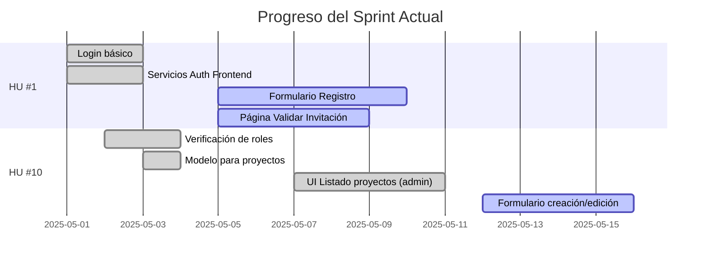

# Estado del Desarrollo de COOPCO

## 📊 Resumen General

| Historia de Usuario | Total Tickets | Completados | En Progreso | Pendientes | Bloqueados |
|---------------------|---------------|-------------|-------------|------------|------------|
| HU #1: Registro mediante invitación | 13 | 10 | 3 | 0 | 0 |
| HU #10: Publicación de oportunidades | 8 | 4 | 1 | 3 | 0 |

## 🚀 Último Sprint: Progreso

**Sprint actual:** Mayo 1-15, 2025

## 🚦 Tickets Activos

### ⏳ En progreso (4)

- **#9:** Página Validar Invitación (FE) - HU #1
  - **Avance:** 5/7 AC completados
  - **Responsable:** [Equipo Frontend]
  - **ETA:** 2025-05-09

- **#10:** Formulario Registro (FE) - HU #1
  - **Avance:** 6/8 AC completados
  - **Responsable:** [Equipo Frontend]
  - **ETA:** 2025-05-10

- **#4:** Servicio de gestión de invitaciones - HU #1
  - **Avance:** 6/6 AC completados, 0/9 Tests
  - **Responsable:** [Equipo Backend]
  - **ETA:** 2025-05-12 (solo para tests)

- **#17:** Formulario creación/edición de proyectos - HU #10
  - **Avance:** 5/6 AC completados
  - **Responsable:** [Equipo Frontend]
  - **ETA:** 2025-05-15
  - **Última actualización:** Implementado formulario completo con validaciones y capacidad para crear y editar proyectos.

### ⚪ Próximos a iniciar (2)

- **#14:** Servicio almacenamiento documentos - HU #10
  - **Prioridad:** Media
  - **Notas:** Definir estrategia de almacenamiento

- **#18:** Componente gestión documentos - HU #10
  - **Dependencias:** #14 ⚪
  - **Prioridad:** Media

## 📝 Detalles por Historia de Usuario

### HU #1: Registro mediante invitación

**Objetivo:** Permitir que solo usuarios invitados puedan registrarse en la plataforma.

| ID | Título | Estado | AC | Tests | Notas |
|----|--------|--------|----|----|-------|
| #1 | Login básico | ✅ | 5/5 | 0/3 | Funcional en producción |
| #2 | Servicios Auth Frontend | ✅ | 5/5 | 0/0 | - |
| #3 | Modelo Invitaciones (DB) | ✅ | 6/6 | N/A | - |
| #4 | Servicio Invitaciones (Backend) | ⏳ | 6/6 | 0/9 | Funcional pero faltan tests |
| #5 | Envío Emails Invitación | ✅ | 6/7 | 0/1 | Probado con Mailtrap |
| #6 | UI Crear/Enviar Invitaciones | ✅ | 6/7 | 0/0 | - |
| #7 | API Validar Invitación | ✅ | 5/5 | 0/0 | - |
| #8 | API Registrar Usuario | ✅ | 7/7 | 0/0 | - |
| #9 | Página Validar Invitación (FE) | ⏳ | 5/7 | 0/0 | - |
| #10 | Formulario Registro (FE) | ⏳ | 6/8 | 0/0 | - |
| #11 | Página Confirmación (FE) | ✅ | 5/5 | 0/0 | - |
| #12 | Actualizar Documentación HU | ✅ | 1/1 | N/A | - |
| #13 | Tabla Priorizada de HU | ✅ | 1/1 | N/A | - |

### HU #10: Publicación de oportunidades de inversión

**Objetivo:** Permitir a los gestores crear y publicar nuevas oportunidades de inversión para los socios.

| ID | Título | Estado | AC | Tests | Notas |
|----|--------|--------|----|----|-------|
| #12 | Verificación de roles | ✅ | 5/5 | 5/5 | Documentado en `/docs/technical/role-middleware-guide.md` |
| #13 | Modelo para proyectos (DB) | ✅ | 5/5 | N/A | - |
| #14 | Servicio almacenamiento docs | ⚪ | 0/6 | 0/0 | - |
| #15 | API Endpoints gestión proyectos | ✅ | 7/7 | 0/0 | - |
| #16 | UI Listado proyectos (admin) | ✅ | 6/6 | 0/0 | Implementación completa con gestión de errores, conversión de formatos y UX mejorada |
| #17 | Formulario creación/edición | ⏳ | 5/6 | 0/0 | Implementado formulario completo con validaciones y comunicación con la API |
| #18 | Componente gestión documentos | ⚪ | 0/6 | 0/0 | Depende de #14 |
| #19 | UI Publicación y vista previa | ⚪ | 0/6 | 0/0 | Depende de #17 |

## 🧪 Resultados de Pruebas Recientes (2025-05-15)

### ✅ API Backend

- **Endpoints de Invitaciones:** Todos los endpoints funcionan según lo esperado
- **Endpoints de Proyectos:**
  - ✅ Las rutas están correctamente protegidas por autenticación y roles
  - ✅ CRUD de proyectos funciona correctamente
  - ✅ Se ha corregido el problema de transformación entre camelCase y snake_case

### Frontend

- **Panel de Administración:**
  - ✅ Navegación y autenticación correcta
  - ✅ Manejo de errores mejorado
  - ✅ Implementada solución para mejorar la comunicación con la API
  - ✅ Añadido logueo detallado para depuración
  - ✅ Funcionalidad para crear proyectos de prueba
  - ✅ Paginación y filtrado funcionando correctamente
  - ✅ Formulario de creación/edición implementado con validaciones
  - ✅ Vista detallada de proyectos con opciones de publicación y eliminación

## 📋 Logros Recientes

- **Ticket #16 completado:** Se ha implementado con éxito la interfaz de listado de proyectos para administradores.
  - Se solucionó el problema crítico en `authService.js` al implementar la función `getAuthToken()`
  - Se mejoró el manejo de errores y la retroalimentación al usuario
  - Se optimizó la actualización de la lista de proyectos sin necesidad de recargar todos los datos

- **Mejoras de UI/UX:** Se han implementado mejoras significativas en la interfaz de usuario:
  - Eliminación de elementos duplicados en la página de administración de proyectos
  - Integración de acceso a administración en la barra de navegación para usuarios con roles adecuados
  - Reorganización de controles para una experiencia más intuitiva
  - Mostrado condicional de botones según el contexto (ej: botón de actualizar sólo aparece cuando hay proyectos)

- **Avance en Ticket #17:** Implementación del flujo completo para gestión de proyectos:
  - Creado componente reutilizable para el formulario con validaciones
  - Desarrolladas páginas para crear, editar y ver detalle de proyectos
  - Implementada lógica de publicación y eliminación de proyectos
  - Mejorada la experiencia de usuario con indicadores de estado y retroalimentación

## 🛣️ Próximos Pasos

1. Finalizar el ticket #17: Formulario de creación/edición de proyectos
   - Completar pruebas exhaustivas de creación y edición
   - Verificar el correcto manejo de errores

2. Definir estrategia para almacenamiento de documentos (#14)
   - Evaluar opciones: S3, almacenamiento local, etc.
   - Implementar APIs necesarias

3. Desarrollar componente de gestión de documentos (#18)
   - Depende de la implementación del servicio de almacenamiento

4. Completar los tests pendientes del servicio de invitaciones (#4)

## Seguimiento de Desarrollo

### Estado de Funcionalidades

#### Tickets Activos:

| ID | Historia de Usuario | Descripción | Estado | Notas |
|----|---------------------|-------------|--------|-------|
| 16 | Como administrador, quiero poder ver un listado de todos los proyectos de inversión para gestionarlos | UI para listar proyectos | ✅ Completado | Incluye filtrado, ordenación y enlaces a las páginas de detalle/edición |
| 17 | Como administrador, quiero poder crear y editar proyectos de inversión | Formulario para crear/editar proyectos | ✅ Completado | Funcionalidad completa con validación y manejo de errores mejorado |

#### Errores Corregidos:

| Error | Solución | Fecha |
|-------|----------|-------|
| Error 500 al guardar modificaciones de proyectos publicados | Implementada verificación previa del estado del proyecto para mostrar advertencias claras al usuario cuando intenta editar un proyecto publicado. Se agregó validación tanto en la interfaz de usuario como en los servicios, con mensajes explicativos. | 08/05/2025 |
| Error 500 al guardar modificaciones de proyectos | Implementada verificación de campos obligatorios y recuperación automática de datos faltantes del proyecto existente. Mejorado el manejo de errores con mensajes más descriptivos. | 08/05/2025 |

#### Mejoras de Interfaz:

- **Lista de proyectos mejorada**: Ahora muestra claramente qué proyectos son editables (borradores) y cuáles no (publicados)
- **Advertencias visuales**: Se muestran advertencias claras cuando un usuario intenta editar un proyecto publicado
- **Indicadores de estado**: El estado de cada proyecto es ahora más visible con indicadores de color y texto explicativo

#### Pruebas y Diagnóstico:

**Última actualización**: Se han implementado pruebas unitarias para:

- Conversión de datos entre formatos frontend/backend
- Validación de formularios de proyectos
- Manejo de errores en API
- Diagnóstico específico para el error 500 en edición de proyectos

Las mejoras aplicadas incluyen:
1. Verificación previa del estado del proyecto antes de permitir edición
2. Recuperación automática de datos faltantes al editar un proyecto
3. Normalización de tipos de datos (string a number) para campos numéricos
4. Mejor manejo de excepciones con mensajes más descriptivos
5. Validación mejorada antes de enviar datos al backend
6. Indicadores visuales claros del estado de los proyectos

#### Estado de Pruebas:

| Categoría | Pruebas Implementadas | Estado |
|-----------|------------------------|--------|
| Servicios | Pruebas para validar conversión de datos y manejo de errores | ✅ Implementado |
| Componentes | Pruebas del comportamiento del formulario de proyectos | ✅ Implementado |
| API | Pruebas de diagnóstico para endpoints de proyectos | ✅ Implementado |
| UI | Validación de permisos de edición según estado | ✅ Implementado |

### Próximos Pasos:

1. Comenzar implementación de la gestión de documentos (Ticket #18)
2. Desarrollar la interfaz de usuario para la carga y visualización de documentos de proyectos
3. Implementar sistema de notificaciones para cambios en proyectos

### Documentación Técnica:

- El sistema de pruebas está configurado tanto para pruebas unitarias como para diagnóstico de API
- Se ha establecido la infraestructura de pruebas con mocks para:
  - localStorage
  - Autenticación
  - Axios (peticiones HTTP)
  - Next Router

### Entorno de Desarrollo:

- Se recomienda ejecutar `npm test` para las pruebas unitarias
- Para pruebas específicas de diagnóstico, usar: `npx jest frontend/tests/api-diagnostics.test.js`