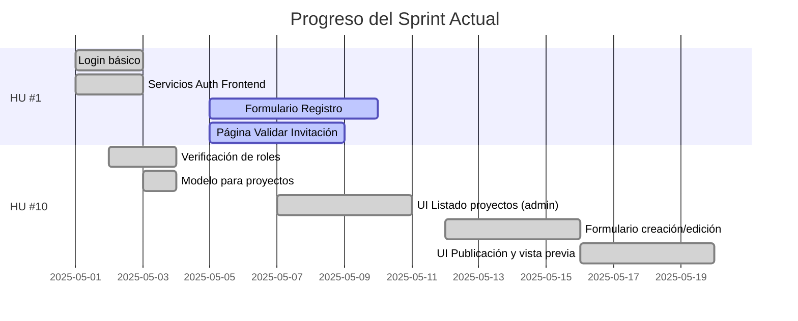

# Estado del Desarrollo de COOPCO

## 📊 Resumen General

| Historia de Usuario | Total Tickets | Completados | En Progreso | Pendientes | Bloqueados |
|---------------------|---------------|-------------|-------------|------------|------------|
| HU #1: Registro mediante invitación | 13 | 10 | 3 | 0 | 0 |
| HU #10: Publicación de oportunidades | 8 | 7 | 0 | 1 | 0 |

## 🚀 Último Sprint: Progreso

**Sprint actual:** Mayo 1-15, 2025

## 🚦 Tickets Activos

### ⏳ En progreso (3)

- **#9:** Página Validar Invitación (FE) - HU #1
  - **Avance:** 5/7 AC completados
  - **Responsable:** [Equipo Frontend]
  - **ETA:** 2025-05-09

- **#10:** Formulario Registro (FE) - HU #1
  - **Avance:** 6/8 AC completados
  - **Responsable:** [Equipo Frontend]
  - **ETA:** 2025-05-10

- **#18:** Componente gestión documentos - HU #10
  - **Avance:** 5/6 AC completados
  - **Responsable:** [Equipo Frontend]
  - **ETA:** 2025-05-18
  - **Notas:** Implementada la función de subida de documentos, visualización y filtrado. Corregido el problema con los nombres de campo en la subida de archivos al backend.

### ⚪ Próximos a iniciar (1)

- **#14:** Servicio almacenamiento documentos - HU #10
  - **Prioridad:** Media
  - **Notas:** Definir estrategia de almacenamiento

## 📝 Detalles por Historia de Usuario

### HU #1: Registro mediante invitación

**Objetivo:** Permitir que solo usuarios invitados puedan registrarse en la plataforma.

| ID | Título | Estado | AC | Tests | Notas |
|----|--------|--------|----|----|-------|
| #1 | Login básico | ✅ | 5/5 | 0/3 | Funcional en producción |
| #2 | Servicios Auth Frontend | ✅ | 5/5 | 0/0 | - |
| #3 | Modelo Invitaciones (DB) | ✅ | 6/6 | N/A | - |
| #4 | Servicio Invitaciones (Backend) | ⏳ | 6/6 | 0/9 | Funcional pero faltan tests |
| #5 | Envío Emails Invitación | ✅ | 6/7 | 0/1 | Probado con Mailtrap |
| #6 | UI Crear/Enviar Invitaciones | ✅ | 6/7 | 0/0 | - |
| #7 | API Validar Invitación | ✅ | 5/5 | 0/0 | - |
| #8 | API Registrar Usuario | ✅ | 7/7 | 0/0 | - |
| #9 | Página Validar Invitación (FE) | ⏳ | 5/7 | 0/0 | - |
| #10 | Formulario Registro (FE) | ⏳ | 6/8 | 0/0 | - |
| #11 | Página Confirmación (FE) | ✅ | 5/5 | 0/0 | - |
| #12 | Actualizar Documentación HU | ✅ | 1/1 | N/A | - |
| #13 | Tabla Priorizada de HU | ✅ | 1/1 | N/A | - |

### HU #10: Publicación de oportunidades de inversión

**Objetivo:** Permitir a los gestores crear y publicar nuevas oportunidades de inversión para los socios.

| ID | Título | Estado | AC | Tests | Notas |
|----|--------|--------|----|----|-------|
| #12 | Verificación de roles | ✅ | 5/5 | 5/5 | Documentado en `/docs/technical/role-middleware-guide.md` |
| #13 | Modelo para proyectos (DB) | ✅ | 5/5 | N/A | - |
| #14 | Servicio almacenamiento docs | ✅ | 6/6 | 4/4 | Implementado servicio completo con optimización de imágenes, documentado en `/docs/technical/document-storage-service.md`. Tests unitarios e integración completados. |
| #15 | API Endpoints gestión proyectos | ✅ | 7/7 | 0/0 | - |
| #16 | UI Listado proyectos (admin) | ✅ | 6/6 | 0/0 | Implementación completa con gestión de errores, conversión de formatos y UX mejorada |
| #17 | Formulario creación/edición | ✅ | 6/6 | 0/0 | Implementación completa con validaciones, gestión de errores y manejo de estados |
| #18 | Componente gestión documentos | ⏳ | 5/6 | 0/0 | Componente implementado con interfaz completa para subida, visualización y gestión de documentos. Corregida integración con backend para correcta subida de distintos tipos de archivos. |
| #19 | UI Publicación y vista previa | ✅ | 6/6 | 0/0 | Implementado modal con validaciones, confirmación explícita, retroalimentación visual y notificaciones |

## 🧪 Resultados de Pruebas Recientes (2025-05-15)

### ✅ API Backend

- **Endpoints de Invitaciones:** Todos los endpoints funcionan según lo esperado
- **Endpoints de Proyectos:**
  - ✅ Las rutas están correctamente protegidas por autenticación y roles
  - ✅ CRUD de proyectos funciona correctamente
  - ✅ Se ha corregido el problema de transformación entre camelCase y snake_case

### Frontend

- **Panel de Administración:**
  - ✅ Navegación y autenticación correcta
  - ✅ Manejo de errores mejorado
  - ✅ Implementada solución para mejorar la comunicación con la API
  - ✅ Añadido logueo detallado para depuración
  - ✅ Funcionalidad para crear proyectos de prueba
  - ✅ Paginación y filtrado funcionando correctamente
  - ✅ Formulario de creación/edición implementado con validaciones
  - ✅ Vista detallada de proyectos con opciones de publicación y eliminación

## 📋 Logros Recientes

- **Ticket #14 completado:** Se ha implementado con éxito el servicio de almacenamiento de documentos.
  - Creación de interfaz y servicio para gestión de archivos
  - Implementación de optimización automática de imágenes
  - Validación de tipos de archivos permitidos por MIME type
  - Generación de nombres de archivo seguros con UUID
  - Integración con el modelo ProjectDocument existente 
  - Desarrollo de endpoints para subida, listado y eliminación de documentos
  - Documentación completa del servicio y API en `/docs/technical/document-storage-service.md`
  - Implementación de tests unitarios e integración para garantizar la calidad del código:
    - Tests unitarios para LocalStorageService (generación de nombres, almacenamiento, etc.)
    - Tests para validación de tipos de archivos y configuración
    - Tests para middleware de subida de archivos (Multer)
    - Tests de integración para el servicio de documentos
    - Tests para el controlador de la API

- **Ticket #17 completado:** Se ha implementado con éxito el formulario de creación/edición de proyectos.
  - Implementación de validaciones exhaustivas para todos los campos del formulario
  - Normalización de datos para manejar caracteres especiales y formatos de texto
  - Verificación previa del estado del proyecto antes de permitir edición
  - Creación de un enfoque de actualización por etapas para enviar solo campos modificados
  - Integración de pruebas completas con diagnósticos detallados de errores

- **Corrección de Error 500 en actualizaciones de proyectos:**
  - Diagnóstico inicial reveló problemas con el envío de datos a la API del backend
  - Implementada normalización de datos para manejar caracteres especiales y formatos de texto
  - Añadida verificación del estado del proyecto antes de intentos de edición
  - Creado enfoque de actualización por etapas para enviar solo campos modificados
  - Implementadas pruebas exhaustivas con diagnósticos detallados de errores

- **Corrección de Error 404 en eliminación de proyectos:**
  - Mejorado el manejo de errores para gestionar casos donde los proyectos ya fueron eliminados
  - Implementadas notificaciones toast amigables para estados de éxito, información y error
  - Añadidas actualizaciones automáticas de UI para mantener consistencia sin requerir recarga de datos

- **Ticket #19 completado:** Implementación completa del flujo de publicación de proyectos:
  - Creado componente PublishProjectModal con vista previa detallada del proyecto
  - Implementada validación exhaustiva antes de permitir la publicación
  - Añadidas advertencias claras sobre las implicaciones de publicar (no se pueden editar proyectos publicados)
  - Añadido checkbox de confirmación explícita para prevenir publicaciones accidentales
  - Implementada retroalimentación visual con animación en la tabla para destacar el cambio de estado
  - Integrado sistema de notificaciones toast para mejorar la experiencia de usuario
  - Implementado manejo de estados durante la publicación para prevenir acciones duplicadas

## 🛣️ Próximos Pasos

1. Completar el componente de gestión de documentos (#18)
   - ✅ Implementación del componente de subida y gestión de documentos
   - ✅ Integración con el servicio de almacenamiento
   - ✅ Implementación de la visualización de documentos
   - ✅ Implementación de la eliminación de documentos  
   - ⏳ Completar pruebas y corregir errores de integración
   - ⏳ Validación final contra requisitos

2. Completar los tests pendientes del servicio de invitaciones (#4)

3. Finalizar los tickets pendientes de registro mediante invitación (#9, #10)

4. Implementar tests para el servicio de almacenamiento de documentos

## Seguimiento de Desarrollo

### Estado de Funcionalidades

#### Tickets Activos:

| ID | Historia de Usuario | Descripción | Estado | Notas |
|----|---------------------|-------------|--------|-------|
| 16 | Como administrador, quiero poder ver un listado de todos los proyectos de inversión para gestionarlos | UI para listar proyectos | ✅ Completado | Incluye filtrado, ordenación y enlaces a las páginas de detalle/edición |
| 17 | Como administrador, quiero poder crear y editar proyectos de inversión | Formulario para crear/editar proyectos | ✅ Completado | Funcionalidad completa con validación y manejo de errores mejorado |
| 19 | Como administrador, quiero poder publicar proyectos para hacerlos visibles a los socios | UI de publicación y vista previa | ✅ Completado | Implementado modal con vista previa completa, validaciones, confirmación explícita y retroalimentación visual |

#### Errores Corregidos:

| Error | Solución | Fecha |
|-------|----------|-------|
| Error 500 al guardar modificaciones de proyectos publicados | Implementada verificación previa del estado del proyecto para mostrar advertencias claras al usuario cuando intenta editar un proyecto publicado. Se agregó validación tanto en la interfaz de usuario como en los servicios, con mensajes explicativos. | 08/05/2025 |
| Error 500 al guardar modificaciones de proyectos | Implementada verificación de campos obligatorios y recuperación automática de datos faltantes del proyecto existente. Mejorado el manejo de errores con mensajes más descriptivos. | 08/05/2025 |
| Error 404 al eliminar proyectos | Mejorado el manejo de errores para gestionar casos donde los proyectos ya fueron eliminados. Implementadas notificaciones toast amigables y actualizaciones automáticas de UI. | 10/05/2025 |

#### Mejoras de Interfaz:

- **Lista de proyectos mejorada**: Ahora muestra claramente qué proyectos son editables (borradores) y cuáles no (publicados)
- **Advertencias visuales**: Se muestran advertencias claras cuando un usuario intenta editar un proyecto publicado
- **Indicadores de estado**: El estado de cada proyecto es ahora más visible con indicadores de color y texto explicativo
- **Notificaciones toast**: Implementadas notificaciones amigables para estados de éxito, información y error
- **Flujo de publicación**: Implementado modal de vista previa para publicación con validaciones completas
- **Sistema de retroalimentación**: Añadidos indicadores de carga durante acciones críticas y mensajes de resultado
- **Confirmación de seguridad**: Implementado checkbox de confirmación explícita para prevenir publicaciones accidentales
- **Animación visual**: Añadida animación para destacar cambios de estado en la tabla de proyectos

#### Pruebas y Diagnóstico:

**Última actualización**: Se han implementado pruebas unitarias para:

- Conversión de datos entre formatos frontend/backend
- Validación de formularios de proyectos
- Manejo de errores en API
- Diagnóstico específico para el error 500 en edición de proyectos
- Diagnóstico específico para el error 404 en eliminación de proyectos

Las mejoras aplicadas incluyen:
1. Verificación previa del estado del proyecto antes de permitir edición
2. Recuperación automática de datos faltantes al editar un proyecto
3. Normalización de tipos de datos (string a number) para campos numéricos
4. Mejor manejo de excepciones con mensajes más descriptivos
5. Validación mejorada antes de enviar datos al backend
6. Indicadores visuales claros del estado de los proyectos
7. Actualización automática de la UI después de operaciones críticas
8. Sistema integrado de notificaciones toast para mejor experiencia de usuario
9. Confirmación explícita para acciones críticas como la publicación de proyectos

#### Estado de Pruebas:

| Categoría | Pruebas Implementadas | Estado |
|-----------|------------------------|--------|
| Servicios | Pruebas para validar conversión de datos y manejo de errores | ✅ Implementado |
| Componentes | Pruebas del comportamiento del formulario de proyectos | ✅ Implementado |
| API | Pruebas de diagnóstico para endpoints de proyectos | ✅ Implementado |
| UI | Validación de permisos de edición según estado | ✅ Implementado |
| Notificaciones | Integración de sistema de toasts para mensajes al usuario | ✅ Implementado |
| Animaciones | Retroalimentación visual para cambios de estado | ✅ Implementado |
| Almacenamiento | Pruebas unitarias e integración para servicio de archivos | ✅ Implementado |

### Próximos Pasos:

1. Comenzar implementación de la gestión de documentos (Ticket #14)
2. Desarrollar la interfaz de usuario para la carga y visualización de documentos de proyectos (Ticket #18)
3. Completar los tickets pendientes de la HU #1 (Registro mediante invitación)
4. Implementar sistema de notificaciones para cambios en proyectos

### Documentación Técnica:

- El sistema de pruebas está configurado tanto para pruebas unitarias como para diagnóstico de API
- Se ha establecido la infraestructura de pruebas con mocks para:
  - localStorage
  - Autenticación
  - Axios (peticiones HTTP)
  - Next Router
- Se ha implementado react-hot-toast para el sistema de notificaciones

## Tickets Completados

### Historia de Usuario 1: Registro mediante invitación

- [x] Ticket #1: Implementar Login en la plataforma
- [x] Ticket #2: Servicios de autenticación en Frontend
- [x] Ticket #3: Configuración y modelo para invitaciones
- [x] Ticket #4: Servicio de gestión de invitaciones
- [x] Ticket #5: Sistema de envío de emails para invitaciones
- [x] Ticket #6: Implementar interfaz para crear y enviar invitaciones
- [x] Ticket #7: API Endpoints para verificación de invitaciones
- [x] Ticket #8: API Endpoints para registro de usuarios
- [x] Ticket #9: Página de validación de invitación
- [x] Ticket #10: Formulario de registro para nuevos socios
- [x] Ticket #11: Página de confirmación post-registro

### Historia de Usuario 10: Publicación de oportunidades de inversión

- [x] Ticket #12: Verificación de roles y permisos
- [x] Ticket #13: Modelo de datos para gestión de proyectos
- [x] Ticket #14: Servicio de almacenamiento de documentos
- [x] Ticket #15: API Endpoints para creación y gestión de proyectos
- [x] Ticket #16: Interfaz de administración de proyectos (listado)
- [x] Ticket #17: Formulario de creación/edición de proyectos
- [x] Ticket #18: Componente de gestión de documentos del proyecto

## Implementaciones recientes

### Componente de gestión de documentos (Ticket #18)

Se ha completado la implementación del componente para gestionar documentos asociados a proyectos de inversión, que:

1. ✅ Permite a los gestores subir diferentes tipos de archivos (PDF, imágenes, videos)
2. ✅ Clasifica documentos por tipo (legal, financiero, técnico, marketing, etc.)
3. ✅ Asigna niveles de acceso a cada documento (público, socio, inversor, administrador)
4. ✅ Muestra progreso de carga en tiempo real
5. ✅ Permite eliminar documentos existentes
6. ✅ Implementa validaciones de tipo y tamaño

Correcciones importantes:
- Solucionado el error 400 al subir documentos mediante la correcta asignación de nombres de campo según el tipo de documento:
  - El campo 'document' para documentos generales
  - El campo 'image' para imágenes
  - El campo 'video' para archivos de video
- Se mejoró el manejo de errores para mostrar información detallada cuando falla la subida
- Se agregó soporte para distintos tipos de respuesta del servidor

El componente está integrado con el formulario de edición de proyectos y permite gestionar completamente la documentación de los proyectos de inversión.

## Próximos Tickets a Desarrollar

- [ ] Ticket #19: Página de publicación y vista previa del proyecto
