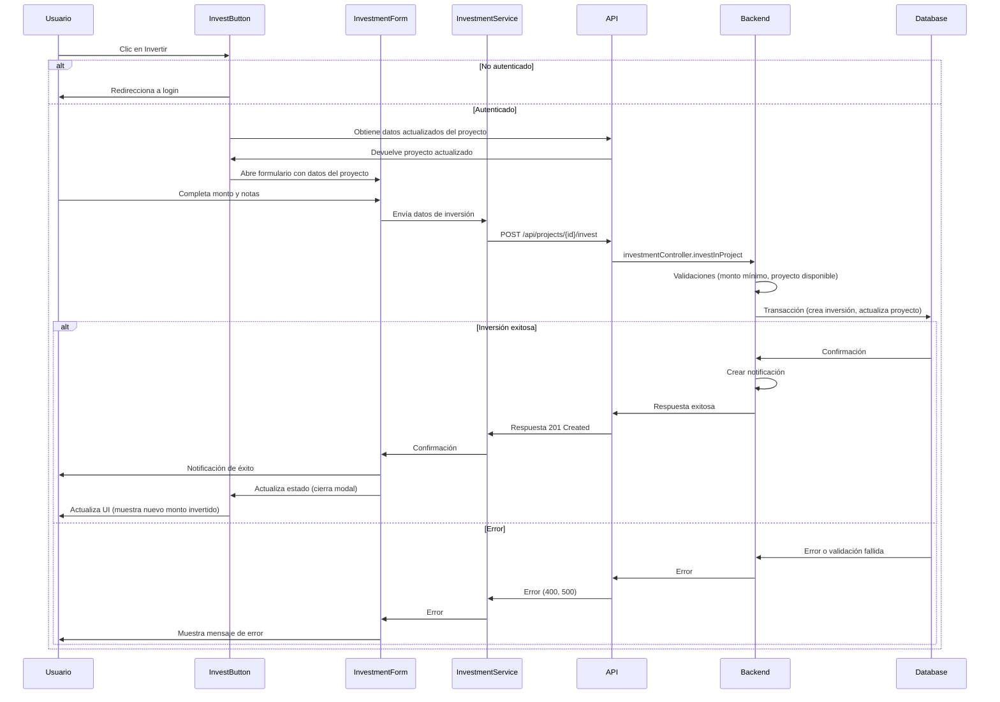
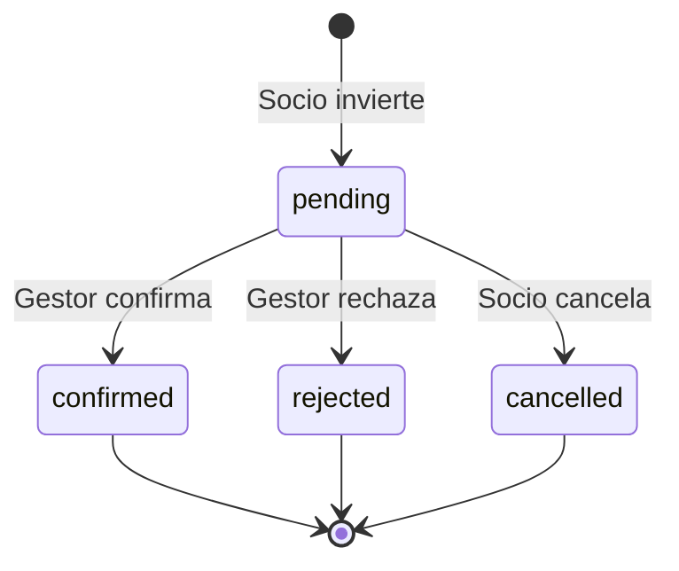

# Flujo de Inversión en COOPCO

Este documento técnico describe la implementación del flujo de inversión en la plataforma COOPCO, correspondiente a la Historia de Usuario 3 (HU3) "Marcar Invierto".

## Arquitectura

El sistema de inversiones sigue una arquitectura en capas conforme al diseño general de la aplicación:

```
┌─────────────────┐     ┌─────────────────┐     ┌─────────────────┐     ┌─────────────────┐
│                 │     │                 │     │                 │     │                 │
│  Presentación   │────▶│    Interfaces   │────▶│   Aplicación    │────▶│     Dominio     │
│    (Frontend)   │     │    (Backend)    │     │   (Servicios)   │     │   (Entidades)   │
│                 │     │                 │     │                 │     │                 │
└─────────────────┘     └─────────────────┘     └─────────────────┘     └─────────────────┘
        ▲                                                                       │
        │                                                                       │
        │                                                                       ▼
        │                                                            ┌─────────────────┐
        │                                                            │                 │
        └────────────────────────────────────────────────────────────│ Infraestructura │
                                                                     │  (Base Datos)   │
                                                                     │                 │
                                                                     └─────────────────┘
```

## Componentes Principales

### Entidades de Dominio

1. **Investment (backend/domain/entities/investment.js)**
   - Representa una inversión realizada por un socio en un proyecto
   - Métodos para validación y cambios de estado
   - Relaciones con Project y User

2. **Project (actualizado en backend/domain/entities/project.js)**
   - Métodos añadidos para:
     - Verificar montos mínimos de inversión
     - Gestionar la adición/eliminación de inversiones
     - Calcular estado de financiación

### Servicios de Aplicación

1. **InvestmentService (backend/application/services/investmentService.js)**
   - Gestiona todas las operaciones CRUD para inversiones
   - Implementa transacciones para garantizar la integridad de los datos
   - Se integra con NotificationService para enviar notificaciones

### Interfaces HTTP

1. **InvestmentController (backend/interfaces/http/controllers/investment.controller.js)**
   - Controla las solicitudes HTTP relacionadas con inversiones
   - Implementa validación de datos
   - Gestiona permisos y autorizaciones por rol

2. **InvestmentRoutes (backend/interfaces/http/routes/investment.routes.js)**
   - Define las rutas de API para operaciones de inversión
   - Aplica middleware de autenticación y verificación de roles

### Frontend

1. **InvestmentService (frontend/services/investmentService.js)**
   - Cliente para comunicación con las API de inversiones
   - Manejo de errores y formateo de respuestas

2. **InvestmentForm (frontend/components/projects/InvestmentForm.jsx)**
   - Formulario para ingresar monto y detalles de inversión
   - Validación en cliente 
   - Sugerencias de montos de inversión

3. **InvestButton (frontend/components/projects/InvestButton.jsx)**
   - Componente que muestra un botón para invertir
   - Maneja el flujo de UI para el proceso de inversión
   - Gestiona estados de autenticación y disponibilidad

## Flujo de Inversión



## Estados de una Inversión

Las inversiones pueden pasar por los siguientes estados:

1. **pending**: Estado inicial cuando un socio registra su intención de invertir
2. **confirmed**: Cuando un gestor confirma la inversión (tras la firma de contrato)
3. **rejected**: Cuando un gestor rechaza la inversión
4. **cancelled**: Cuando el socio cancela su inversión (solo en estado pending)



## Gestión de Transacciones

Para garantizar la integridad de los datos, las operaciones críticas como la creación de inversiones o la actualización de estados se realizan dentro de transacciones de Prisma:

```javascript
return await prisma.$transaction(async (prismaClient) => {
  // 1. Obtener el proyecto
  const projectData = await prismaClient.project.findUnique({...});
  
  // 2. Validar el proyecto y la inversión
  const project = new Project(projectData);
  if (!project.isAvailableForInvestment()) {
    throw new Error('El proyecto no está disponible para inversiones');
  }
  
  // 3. Crear la inversión
  const createdInvestment = await prismaClient.investment.create({...});
  
  // 4. Actualizar el monto actual del proyecto
  await prismaClient.project.update({
    where: { id: projectId },
    data: {
      currentAmount: { increment: parseFloat(amount) }
    }
  });
  
  // 5. Crear notificaciones
  await this.notificationService.createNotification({...});
  
  return createdInvestment;
});
```

## Seguridad y Permisos

El sistema de inversiones implementa múltiples capas de seguridad:

1. **Autenticación**: Todas las rutas requieren un usuario autenticado
2. **Verificación de roles**: Solo usuarios con roles específicos pueden realizar inversiones:
   - `partner`: Puede invertir en proyectos
   - `investor`: Puede invertir en proyectos
   - `manager`: Puede gestionar inversiones
   - `admin`: Acceso completo

3. **Validación de datos**: Se implementa tanto en el frontend como en el backend:
   - Validación de montos mínimos
   - Verificación de disponibilidad del proyecto
   - Control de cambios de estado según reglas de negocio

## Pruebas

El sistema cuenta con los siguientes tipos de pruebas:

1. **Pruebas unitarias**:
   - Tests para la entidad Investment
   - Tests para los métodos de Project relacionados con inversiones
   - Tests para InvestmentService

2. **Pruebas de integración**:
   - Tests para los endpoints de API
   - Tests para el flujo completo de inversión

## Integración con otros sistemas

El sistema de inversiones se integra con:

1. **Sistema de notificaciones**: Envía notificaciones a socios y gestores
2. **Sistema de proyectos**: Actualiza el estado de financiación de proyectos
3. **Próximamente**: Integración con sistema de reportes y dashboard para gestores

## Próximos pasos

Los siguientes tickets pendientes de implementación son:

1. **#47**: Página de "Mis Inversiones" para socios
2. **#48**: Componente de resumen de inversiones en proyecto
3. **#49**: Sistema de notificaciones específico para inversiones
4. **#50**: Tests e2e para flujo de inversión
5. **#51**: Dashboard para gestores con resumen de inversiones 